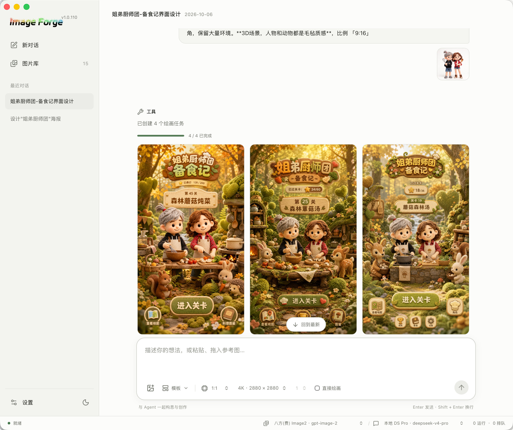

<h1 align="center">Image Forge</h1>

<p align="center">
  <strong>把灵感变成可管理、可复用、可持续迭代的视觉资产。</strong>
</p>

<p align="center">
  本地优先的 AI 图像生产工作台 · Agent 对话绘画 · BYOK
</p>



<p align="center">
  
  
  
  
  
</p>

## 这是什么

Image Forge 不是一个把提示词转发给接口的薄壳，而是一套本地运行的视觉生产系统：它把提示词、参考图、模型参数、队列状态、生成结果和复用关系组织成一条完整链路。模型负责理解与规划，Rust 负责校验与执行，数据留在本机。

## 核心功能

### Agent 对话创作：聊天即生产入口

像聊天一样工作。用自然语言描述目标，Agent 分析需求、追问细节、生成结构化绘图计划，然后交给本地绘画队列执行——全程无需离开对话。

- **会话持久化**：消息、附件、Tool Call、任务组与生成状态全部入库，随时回到上一轮继续改。
- **参考图优先**：选择、粘贴、拖放参考图都会自动进入绘画计划；Agent 支持视觉模型时能看图说话。
- **批量绘制**：输入区可选数量 1–8，一次创建一组任务，对话里立即铺出与所选比例一致的占位格，画完一张补一张；同组任务严格串行，一张画完再画下一张。
- **直接绘画**：勾选后提示词绕过对话模型直达生图模型；比例、分辨率、数量一键选定。
- **图片即操作**：生成结果悬停出现工具条——复制图片、再来一张（提示词+参考图+生成参数一键回填输入框）、添加到模板、从对话删除（图片库保留）。
- **受控工具**：Agent 能调用的只有「创建绘画任务 / 查询任务状态 / 查询模板」三个工具，参数一律经 Rust 校验，模型没有文件、网络或执行能力。

### 模板系统：让好提示词变成资产

好用的提示词值得沉淀下来反复用、分享出去。

- 模板承载标题、提示词内容、参考图和效果图，支持排序与收藏。
- AI 填充：模板里用 `{}` 占位符描述可变部分，Agent 会按你的意图把模板填充成完整提示词。
- 一键入模：对任何生成结果点「添加到模板」，提示词、参考图、效果图自动就位，标题预填提示词前 20 字。
- ZIP 导入导出：模板连同参考图打包成 `.zip`，在设备之间迁移或分享给他人；重复模板自动跳过。

### BYOK：自带 Key，直连厂商

Image Forge 不提供也不代理任何模型服务。你配置自己的 API 源，请求从本机直连你填写的地址。

- **Key 只存本机**：API Key 保存在本地 SQLite 的设置表里，不经过任何中间服务器，没有遥测上传。
- **多源并存**：绘图 API 与对话 API 各自独立配置，可同时接入多家供应商并随时切换；生图请求按供应商配置并发数排队。
- **协议差异封装**：OpenAI 图像、Gemini、Grok 等不同图像协议的差异被封装在 Rust 服务层，界面与队列只面对统一模型。
- **换源不换工作流**：供应商信息随任务记录保存，图片库能告诉你每张图出自哪家模型。

## 你会得到什么

- **一致的参考图资产**：图片按 SHA-256 内容去重，任务、模板和 Agent 会话共享同一份本地资源。
- **可恢复的本地数据**：任务历史、设置、模板、队列和 Agent 会话统一存入本地 SQLite 并事务写入；请求参数和生成图片以文件形式保存在数据目录中。
- **不放过大失败的队列**：失败任务可单独重试、可整组取消；请求参数以文件保存，历史任务可以原样重画。
- **适合长时间工作的桌面界面**：最小窗口尺寸为 `1200×800`，窗口尺寸按逻辑像素保存，Retina 屏幕恢复不会缩成半个窗口。

## 界面入口

应用默认进入 Agent 工作台：

- 左侧：新对话、内嵌图片库（带图片总数角标）、会话历史、设置。
- 中间：当前对话或按月份浏览的图片库；顶部标题点击即可改名。
- 底部：当前绘图 API / 对话 API 与队列状态。

设置对话框继续提供模板库、对话 API、绘图 API 和关于。

## 本地数据

默认数据目录为 `~/.image-forge`：

```text
~/.image-forge/
  library.sqlite             # 所有结构化数据（7 张 SQLite 表）
  requests/<task-id>.json    # 可重试的原始绘图请求
  outputs/YYYY/MM/           # 按年月组织的生成图片
  references/                # SHA-256 去重后的参考图
```

除直连你配置的模型 API 外，应用不依赖任何远程服务。首次升级会把旧 `history.json` 和对应图片迁移到 SQLite 与年月目录，并保留 `.bak` 和 `.migrated` 备份。清理孤岛文件时会扫描数据库、模板、请求和会话引用；无人引用的图片进入系统回收站，而不是静默永久删除。

## 开发

### 环境

- Node.js 与 PNPM
- Rust toolchain
- macOS 桌面环境（完整 Tauri 工作流）

安装依赖：

```bash
pnpm install
```

启动完整桌面开发模式：

```bash
pnpm tauri dev
```

只启动 Vue 开发服务器：

```bash
pnpm run dev
```

只启动前端时，Tauri 命令、系统文件对话框、队列和本地图片协议不可用；需要完整功能时使用 `pnpm tauri dev`。

### 检查

```bash
pnpm verify        # lint + 格式 + 测试 + cargo check 的一站式校验
pnpm test
cargo fmt --manifest-path src-tauri/Cargo.toml --check
cargo test --manifest-path src-tauri/Cargo.toml
```

### 版本与发布

```bash
pnpm run patch -- <next-version>   # 升级版本号（package.json / Cargo.toml / tauri.conf.json 同步）
pnpm build                          # 本地打包 .app（release/ 目录，默认不产 .dmg）
pnpm release <version>              # 云端发布：升版本 → commit → tag → push，GitHub Actions 三平台构建并发布 Release
```

本地预发布只保留 `src-tauri/target/release` 作为 Rust 增量编译缓存，其余构建过程文件移入系统回收站；`release/` 目录只保留当前版本产物。

## 设计文档

完整的模块边界、数据流、队列事务、Agent 协议和发布规则见 [技术设计](docs/technical-design.md)。

## 许可证与致谢

项目的许可证信息以仓库实际文件为准。界面与工作流设计参考了开源项目 [ilab-gpt-conjure](https://github.com/kadevin/ilab-gpt-conjure) 的部分理念。
