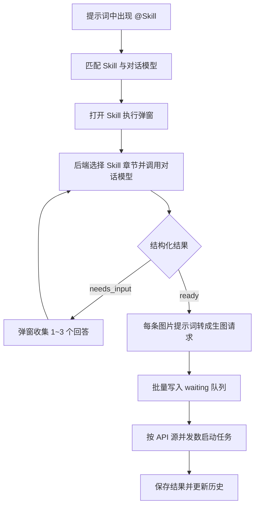
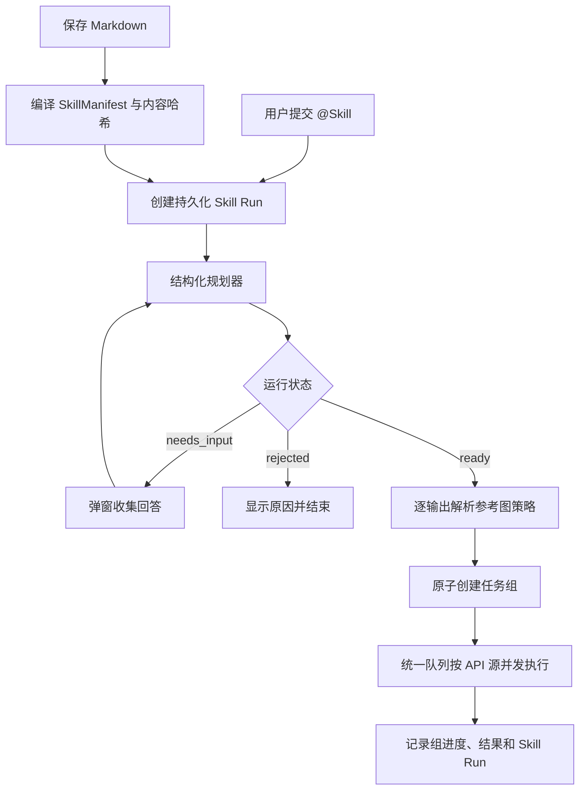

# Image Forge Skill 处理流程

本文描述 Image Forge `1.0.1` 代码中的 Skill 真实处理流程，并在后半部分给出一套更一致、可扩展的新流程建议。这里的 Skill 指保存在本机 `skills.json` 中、由 Markdown 描述且不依赖外部脚本的图片工作流规范。

## 一、当前实现

### 1. Skill 的录入与保存

Skill 可以通过三种方式进入编辑器：

1. 手工粘贴 Markdown；
2. 从 HTTP、HTTPS 或 GitHub URL 提取 Markdown；
3. 把本地 `.md` 文件拖到 URL 区或内容区。

前端把草稿交给 Rust 命令 `save_skill`。后端在保存前调用 `normalize_skill`：

- 清理 ID、来源 URL、备注和正文首尾空白；
- 拒绝空正文；
- 检查 Markdown 是否引用外部脚本；
- 按 frontmatter 的 `name`、一级标题、首个非空行的顺序自动提取名称；
- 新 Skill 生成 UUID，写入创建和更新时间；
- 最终保存到应用数据目录中的 `skills.json`。

当前实现只接受纯 Markdown Skill，不执行 Skill 自带的脚本、命令或外部工具。

### 2. Skill 的引用

用户可以通过两种方式把 Skill 引入主提示词：

- 点击“引用 skill”，从列表中选择名称或备注；
- 在提示词输入框输入 `@`，通过弹出列表搜索并补全 Skill 名称。

引用后，主提示词中会出现：

```text
@Skill名称 用户的画面需求
```

提交任务时，`submitTask` 使用正则识别第一个合法的 `@名称`。名称匹配支持 Skill ID、完整名称、名称的第一个短词、空格转短横线和移除空格等别名。匹配成功后，`@Skill名称` 会从用户需求中移除，剩余文本作为本次 Skill 的原始任务。

如果没有找到 Skill，应用显示错误；如果没有配置对话模型，应用会要求先选择对话模型。普通提示词没有 Skill 引用时，仍直接进入单图生成流程。

### 3. 启动 Skill 会话

找到 Skill 后，前端打开 `SkillRunDialog`，并建立一份仅存在于当前前端内存中的会话状态：

- Skill ID 与名称；
- 包含 `@Skill名称` 的原始提示词；
- 去掉 Skill 引用后的用户任务；
- 补充问题和答案；
- 对话历史；
- 流式输出预览；
- 当前 session ID、等待时间和取消标记。

随后前端调用 Rust 命令 `plan_skill_generation`，传入：

- 对话模型 ID；
- Skill ID；
- 用户任务；
- 补充对话历史；
- 当前是否存在参考图。

这里传递的只有“有没有参考图”这一布尔值，不包含参考图内容、尺寸、文件名或视觉描述。

### 4. 后端组装 Skill 规划请求

Rust 后端依次完成以下工作：

1. 验证 session ID、对话模型和 API Key；
2. 从 `skills.json` 重新读取指定 Skill；
3. 清理补充对话中的空消息；
4. 根据用户任务和补充回答选择需要交给模型的 Skill 内容；
5. 生成系统提示词和用户提示词；
6. 调用对话模型，并优先尝试流式响应。

Skill 内容不超过 5000 字，或 Markdown 章节不超过 6 个时，会完整发送。更长的 Skill 会按标题切分章节，再用用户任务和补充对话中的中英文词语做简单命中评分，最多保留 6 个章节。第一节始终优先保留；如果命中太少，则退回到前 6 节。

系统提示词要求对话模型严格返回 JSON，核心结构为：

```json
{
  "status": "needs_input | ready",
  "message": "中文说明",
  "promptDepth": "deep | normal",
  "promptFidelity": "original | strict | off",
  "referenceImageUsage": "use | optional | not_needed",
  "questions": [],
  "images": [
    {
      "title": "图片标题",
      "prompt": "可直接交给生图模型的最终提示词"
    }
  ]
}
```

模型必须在“继续提问”和“已经可生成”之间二选一；多张图片必须拆成多条 `images`；每条提示词必须能够直接交给生图模型；是否使用参考图也必须给出明确结论。

### 5. 解析、校验与交互

后端从模型文本中截取 JSON，反序列化为 `SkillPlanResult`，然后执行本地校验：

- 根据问题或图片是否存在修正 `status`；
- 把未知的 `promptDepth` 归一为 `normal`；
- 归一化 `promptFidelity`；
- 强制 `referenceImageUsage` 为 `use`、`optional` 或 `not_needed`；
- 最多保留 3 个有效问题；
- 删除空提示词；
- `needs_input` 必须有问题且没有图片；
- `ready` 必须有图片且没有问题。

模型调用过程通过 `skill-planner` 事件把开始、响应模式、流式增量、完成和错误发送给前端。前端在弹窗中显示等待时间与原始流式内容。

如果返回 `needs_input`，前端在同一个弹窗中渲染 1 至 3 个输入框。用户填写后，前端把问题文本记为一条 assistant 消息，把合并后的回答记为一条 user 消息，再发起下一轮规划。会话可以重复多轮，直到返回 `ready` 或用户关闭。

### 6. 提示词转任务

返回 `ready` 后，前端对每个 `images` 项执行 `buildImageRequest`：

- 使用当前主界面选中的生图 API 源；
- 使用当前分辨率、比例和质量；
- 使用 Skill 返回的提示词；
- 根据 `promptDepth` 和 `promptFidelity` 决定提示词保真模式；
- 把当前主界面的全部参考图路径放进每个请求。

所有请求通过 `enqueue_generation_batch` 批量提交。后端为每个请求创建独立任务记录和请求 JSON，把任务 ID 依次追加到 `queue.json` 的 waiting 列表，然后启动后台队列 worker。

前端会在 Skill 弹窗中保留最终提示词列表，并提示这些提示词已经加入画图队列。

### 7. 队列与并发执行

队列 worker 不断从 waiting 列表寻找可运行任务。它按 API 源统计当前 running 数量，只有当：

```text
当前 API 源运行数 < imagesConcurrency
```

时，任务才会从 waiting 移入 running，并在独立异步任务中执行。因此一个 Skill 输出多张图时，每张图会成为一个普通生图任务，并自动遵守对应 API 源的并发限制。



## 二、当前流程的问题

当前流程的总体方向合理：Skill 负责把需求规划成结构化图片任务，交互在生成前完成，多图输出复用统一队列。但实现中仍有几处关键不一致。

### 1. 参考图判断没有真正控制请求

模型会返回 `referenceImageUsage`，前端也会显示“需要参考图”或“参考图可选”，但 `buildImageRequest` 无论返回值是什么，都会把当前全部参考图放进每一个图片任务。因此 `not_needed` 实际没有生效，`optional` 也没有给用户选择机会。

此外，规划器只知道“存在参考图”，看不到参考图本身。它无法基于图片内容判断是否应配合，只能根据 Skill 文本和用户描述猜测。

### 2. 多图只能共享一个参考图策略

`referenceImageUsage` 位于整个结果顶层。多图计划无法表达“第一张使用参考图、第二张不使用”或“不同图片使用不同参考图集合”。

### 3. 批量入队不是原子操作

`enqueue_generation_batch` 逐条创建任务。如果中途某一条请求失败，前面已经写入的任务不会自动回滚，用户可能得到半套任务。

### 4. 取消不等于中止请求

用户关闭 Skill 弹窗后，前端会设置取消标记并忽略迟到的结果，但已经发到对话模型的网络请求仍在后端运行，直到返回或超时。

### 5. 长 Skill 的路由规则比较粗糙

长 Skill 使用词语包含关系挑选最多 6 个章节，没有章节优先级、依赖关系或稳定的摘要索引。关键约束可能因为用户没有使用相同词语而被裁掉。

### 6. JSON 协议依赖提示词约束

当前没有协议版本、能力声明和自动修复轮次。对话模型只要遗漏字段或返回非 JSON，整次执行就会失败；不同模型对同一提示词的遵循程度也可能不同。

### 7. 会话和计划没有持久化

补充对话、最终规划结果和 Skill 版本只存在于当前前端状态。窗口关闭、应用退出或刷新后，无法恢复一次未完成的 Skill 会话，也无法准确追溯历史任务使用了哪个 Skill 版本和规划结果。

## 三、建议的新流程

建议把 Skill 执行改为“编译、规划、交互、确认策略、原子物化、队列执行”六个阶段。保持用户当前习惯不变：信息足够时仍可自动画图，需要回答时仍使用弹窗。

### 阶段 1：保存时编译 Skill

保存 Markdown 时生成一份内部 `SkillManifest`：

```json
{
  "schemaVersion": 1,
  "skillId": "uuid",
  "contentHash": "sha256",
  "name": "Skill 名称",
  "sections": [],
  "requiredSections": [],
  "outputCapability": "image_plan"
}
```

章节解析、必选规则和内容哈希在保存时完成。执行时按 manifest 路由，并始终附带全局约束和 required sections，避免临时按词语裁剪掉关键规则。

### 阶段 2：创建持久化 Skill Run

用户提交 `@Skill` 后，后端先创建 `skill-runs/<run-id>.json`，记录：

- Skill ID、名称和内容哈希；
- 用户任务；
- 生图 API 源和对话模型；
- 分辨率、比例、质量；
- 参考图 ID、文件名、尺寸和可选视觉摘要；
- 当前阶段、问题、回答、最终计划和错误。

这样可以恢复未完成会话，也能让历史任务准确追溯来源。

### 阶段 3：结构化规划

规划器改用带版本的响应协议，并把参考图策略放到每一张图上：

```json
{
  "schemaVersion": 1,
  "state": "needs_input | ready | rejected",
  "message": "说明",
  "questions": [],
  "outputs": [
    {
      "id": "image-1",
      "title": "图片标题",
      "prompt": "最终提示词",
      "referencePolicy": "use | optional | none",
      "referenceIds": ["ref-1"]
    }
  ]
}
```

如果模型返回格式错误，后端先进行一次只修复结构、不重新规划内容的 JSON repair；仍失败才提示用户。

### 阶段 4：弹窗交互与参考图决策

- `needs_input`：继续在 Skill 弹窗中逐项提问；
- `referencePolicy=use`：任务必须携带指定参考图；
- `referencePolicy=none`：任务不得携带参考图；
- `referencePolicy=optional`：弹窗提供一次明确开关，默认沿用用户是否已附图；
- `rejected`：展示 Skill 无法执行的原因，不创建任务。

如果应用未来支持视觉对话模型，可把低分辨率参考图或受控视觉描述发送给规划器；不支持时必须明确告诉规划器它只能依据元数据判断。

### 阶段 5：原子生成任务组

所有输出先在内存中完成校验和请求构建，然后一次性写入：

- 一个 `taskGroupId`；
- 一组请求文件；
- 一组历史记录；
- 一次 queue 更新。

任一步骤失败都不写入任何任务。任务组记录 Skill Run ID、输出顺序和总数量，前端可以把一套多图结果作为一个组查看、重试或删除。

### 阶段 6：统一队列执行

任务物化后继续使用当前队列系统，无需为 Skill 单独实现调度器。队列仍按 API 源的 `imagesConcurrency` 控制并发，但可增加：

- 同一任务组的公平调度，避免大批量 Skill 长时间占满队列；
- 任务组进度，例如 `3 / 9`；
- 整组重试和只重试失败项；
- Skill Run 取消令牌，真正中止尚未完成的对话请求。



## 四、建议实施顺序

建议按风险从低到高分四步落地：

1. 先让 `referenceImageUsage` 真正控制 `referencePaths`，修复当前行为不一致；
2. 再把参考图策略下沉到每个图片输出，并为 `optional` 增加弹窗选择；
3. 增加 `taskGroupId` 和原子批量入队，完善多图任务组；
4. 最后增加 SkillManifest、Skill Run 持久化、结构修复和后端取消令牌。

第一步属于现有流程的缺陷修复；后面三步属于架构升级，可以分别实施，不需要一次性重写全部 Skill 功能。
