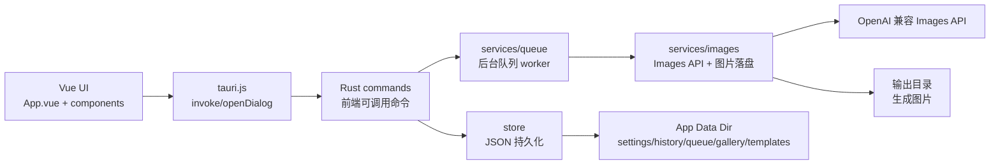
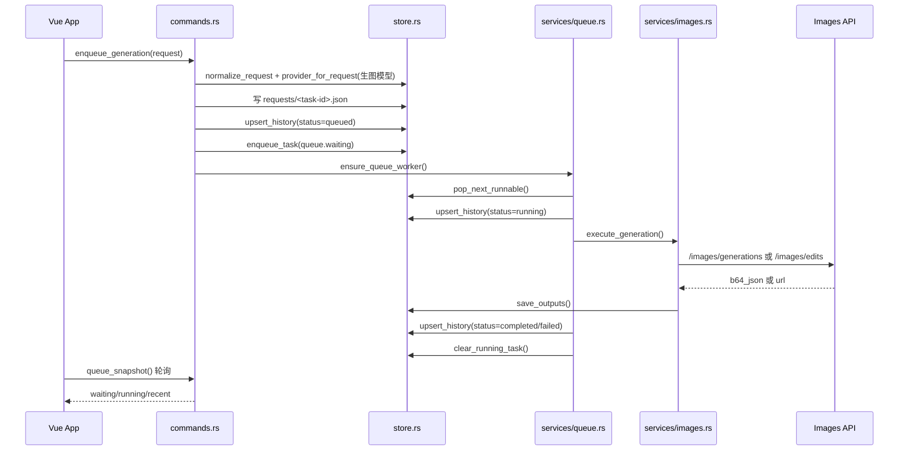
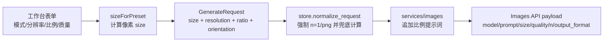

# Image Forge 技术设计

Image Forge 是一个 Tauri 2 + Vue 3 的本地生图工作台。前端负责工作台交互和状态展示，Rust 端负责本地文件持久化、队列调度、Images API 请求和系统能力调用。

## 总览



## 前端架构

前端仍然是单页应用，但 UI 已拆成可维护的单文件组件，所有组件都使用 Vue Template 语法。

| 文件 | 职责 |
| --- | --- |
| `src/App.vue` | 页面控制器：集中管理状态、computed、Tauri 命令调用、轮询和业务动作。 |
| `src/components/AppTopbar.vue` | 顶部品牌、对话模型选择、API 源/模板/设置入口。 |
| `src/components/QueuePanel.vue` | 生成历史搜索和任务列表。 |
| `src/components/ResultPanel.vue` | 当前任务状态、结果图片预览、详情和重用入口。 |
| `src/components/ComposerPanel.vue` | 生图模型选择、生成参数、提示词输入、参考图条。 |
| `src/components/TaskCard.vue` | 单个历史任务卡片，负责展示结果、计时器和重用/刷新/下载/定位/重试/删除动作。 |
| `src/components/dialogs/ApiSourceDialog.vue` | API 源/模型管理、类型选择、导入、复制、排序和编辑；内部 ID 自动生成且不展示。 |
| `src/components/dialogs/TemplateManagerDialog.vue` | 模板维护弹窗：对话模型选择、搜索、模板列表、查看/编辑/删除、新增/引用/AI 填充入口。 |
| `src/components/dialogs/TemplateEditorDialog.vue` | 模板编辑弹窗。 |
| `src/components/dialogs/SettingsDialog.vue` | 输出目录、队列重试和通知设置。 |
| `src/components/dialogs/TaskDetailDialog.vue` | 任务详情、输出图列表和重用入口，弹窗不超过屏幕可视区域并允许滚动。 |
| `src/lib/models.js` | 前端默认数据结构、空草稿对象、深拷贝和设置归一化。 |
| `src/lib/options.js` | 生图参数选项和预设换算：提示词模式、分辨率、比例、质量、尺寸映射。 |
| `src/lib/formatters.js` | 状态标签、短 ID、文件名、文件 URL、clamp 等展示工具。 |
| `src/lib/theme.js` | Naive UI 主题覆盖。 |
| `src/tauri.js` | 对 `window.__TAURI_INTERNALS__` 的轻封装。 |

### 前端数据传递

- `App.vue` 持有唯一业务状态源：`settings`、`queue`、`history`、`templates`、`references`、`form`。
- 顶部栏维护 `form.chatProviderId`，用于后续对话模型填充模板；工作台质量参数下方维护 `form.providerId`，用于当前生图模型。
- 生图模型默认优先使用最近一次成功生成的模型；如果该模型不在当前列表里，默认选中第一个生图模型。
- 生成工作台只暴露五类参数：提示词模式、分辨率、比例、质量、生图模型；数量固定为 `1`，输出格式固定为 `png`。
- 前端提交前用 `sizeForPreset(resolution, ratio)` 把 `1K/2K/4K + 比例` 换算成 Images API 需要的像素尺寸。
- 展示组件通过 props 接收数据，通过 events 把动作抛回 `App.vue`。
- 表单型组件接收草稿对象并直接修改对象字段，保存动作仍由 `App.vue` 调用 Rust 命令。
- `App.vue` 启动后调用 `load_app_state`，随后每 1.6 秒调用 `queue_snapshot` 刷新队列。

## Rust 架构

Rust 端按层拆分，`lib.rs` 只负责注册模块、插件和 Tauri 命令。

| 文件 | 职责 |
| --- | --- |
| `src-tauri/src/lib.rs` | Tauri 入口：注册 `RuntimeState`、dialog 插件、setup 恢复队列、invoke handler。 |
| `src-tauri/src/commands.rs` | 前端可调用命令层：组装参数、调用 store/services、返回序列化结果。 |
| `src-tauri/src/models.rs` | Rust 与前端共享的 serde 数据模型。 |
| `src-tauri/src/defaults.rs` | 默认值、常量、serde default 函数。 |
| `src-tauri/src/state.rs` | 运行期内存状态：worker 是否活跃、取消请求集合。 |
| `src-tauri/src/store.rs` | JSON 文件数据库：路径管理、读写、设置/请求/历史/队列/图库/模板归一化。 |
| `src-tauri/src/services/queue.rs` | 后台队列 worker、并发调度、取消、失败重试、运行中任务恢复。 |
| `src-tauri/src/services/images.rs` | Images API 请求、编辑/生成分支、响应解析、参考图预览、生成结果落盘。 |
| `src-tauri/src/utils.rs` | URL、MIME、扩展名、ID、时间、HTTP client、错误格式化等通用工具。 |

## 本地数据存储

项目没有使用传统数据库。Rust 端把应用数据写入 Tauri 的 `app_data_dir()`，用 JSON 文件和图片文件组成一个轻量本地数据库。

```text
app_data_dir/
  settings.json
  queue.json
  history.json
  prompt-templates.json
  requests/
    <task-id>.json
  outputs/
    <timestamp>-<task-id>-01.png
  gallery/
    gallery.json
    images/
      <uuid>.png
```

| 数据 | 文件 | 内容 |
| --- | --- | --- |
| 设置/API 源 | `settings.json` | 当前生图/对话模型、多个 provider、输出目录、自动队列、自动重试等。 |
| 队列状态 | `queue.json` | `waiting` 任务 ID 列表、`running` 任务记录、更新时间。 |
| 历史任务 | `history.json` | 最近任务记录，最多保留 `MAX_HISTORY_ITEMS`。 |
| 原始请求 | `requests/<task-id>.json` | 每个任务的生图参数，用于重试和恢复。 |
| 输出图片 | `outputs/` 或设置中的输出目录 | 生成图片文件。 |
| 图库元数据 | `gallery/gallery.json` | 图库条目、分类列表。 |
| 图库图片 | `gallery/images/` | 导入或保存到图库的图片副本。 |
| 提示词模板 | `prompt-templates.json` | 模板内容、分类、收藏、使用次数。 |

## 生图运行逻辑



### 队列调度规则

- `ensure_queue_worker()` 通过 `RuntimeState.worker_active` 保证同时只有一个调度循环。
- `pop_next_runnable()` 按 `queue.waiting` 顺序取任务，只选择 `modelType=image` 的 provider，并按 provider 的 `images_concurrency` 限制并发。
- 每个任务执行前写入 `running` 状态；完成后写输出并从 `queue.running` 移除。
- 如果开启 `autoRetry`，任务第一次失败后会重新入队一次。
- App 启动时 `recover_stale_running()` 会把上次异常退出留下的 running 任务恢复到 waiting。
- 取消运行中任务时，命令层只写入 `cancel_requests`，worker 在 API 调用前后检查并标记为 cancelled。

## API 调用逻辑

- 无参考图且无 mask：调用 `<baseUrl>/images/generations`。
- 有参考图或 mask：调用 `<baseUrl>/images/edits`，通过 multipart 上传图片。
- Base URL 会归一化，自动去掉 `/images/generations` 或 `/images/edits` 后缀。
- 响应支持 `b64_json` 和 `url` 两种图像返回方式。
- 输出格式会根据 API 字段和文件头归一化为 `png`、`jpeg` 或 `webp`。
- 生图请求参数与 `example/codex_image/webui` 保持一致：`size` 是像素尺寸，`quality` 是 `auto/low/medium/high`，`n` 固定 `1`，`output_format` 固定 `png`。
- `resolution`、`ratio`、`orientation`、`prompt_fidelity` 会作为任务元数据保存；Rust 端也会重新归一化并在前端漏传时兜底计算 `size`。
- 发送 API 前会把比例写入模型提示词，例如 `16:9` 会追加 `将宽高比设为 16:9`，避免只靠 `size` 时模型忽略构图比例。
- `prompt_fidelity=strict` 会参考 example 的 direct Images transport，在出站 prompt 前追加保真守护指令；`original/off` 则保持用户提示词本身。

### 生图参数映射

| UI 字段 | 前端值 | API/存储字段 | 说明 |
| --- | --- | --- | --- |
| 提示词模式 | `original` / `strict` / `off` | `prompt_fidelity` | 原始模式、保真模式、创意模式；`strict` 会包装出站 prompt，后续对话模型填模板也会继续使用。 |
| 分辨率 | `standard` / `2k` / `4k` | `resolution` | UI 显示为 `1K`、`2K`、`4K`。 |
| 比例 | `1:1` 等 11 种比例 | `ratio` / `orientation` | `orientation` 自动归类为 `square`、`portrait`、`landscape`。 |
| 质量 | `auto` / `low` / `medium` / `high` | `quality` | UI 显示为自动、低、中、高。 |
| 数量 | 固定 `1` | `n` / `count` | UI 不再展示，Rust 端也强制归一化为 `1`。 |
| 输出格式 | 固定 `png` | `output_format` | UI 不再展示，Rust 端也强制归一化为 `png`。 |



## 模型选择设计

`settings.providers` 仍然是统一模型配置列表，每个条目用 `modelType` 区分用途：

- `image`：生图模型，参与生图队列和 Images API 调用。
- `chat`：对话模型，当前只在顶部栏展示和选择，后续用于“用对话模型填充模板”。

关键字段：

| 字段 | 说明 |
| --- | --- |
| `id` | 内部稳定 ID，前端自动随机生成，供应商维护弹窗不展示。 |
| `modelType` | `image` 或 `chat`；新增和导入默认 `image`。 |
| `imageModel` | 当前仍作为通用模型 ID 字段，生图和对话模型都复用它。 |
| `activeImageProviderId` | 当前默认生图模型。 |
| `activeChatProviderId` | 当前默认对话模型。 |
| `activeProviderId` | 旧字段，继续保留为生图模型兼容字段。 |

## 开发约定

- 新的 UI 面板优先放入 `src/components/`，弹窗放 `src/components/dialogs/`，抽屉放 `src/components/drawers/`。
- 新的前端默认数据结构放 `src/lib/models.js`，展示格式化放 `src/lib/formatters.js`。
- 新的 Tauri 命令放 `src-tauri/src/commands.rs`，不要直接塞进 `lib.rs`。
- 会访问本地 JSON 的逻辑放 `store.rs`；会请求外部 API 或执行后台任务的逻辑放 `services/`。
- 新增持久化文件时，同步更新本文档的“本地数据存储”章节。
