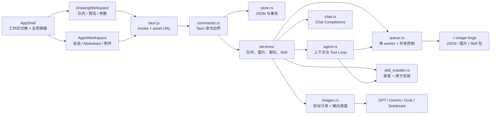
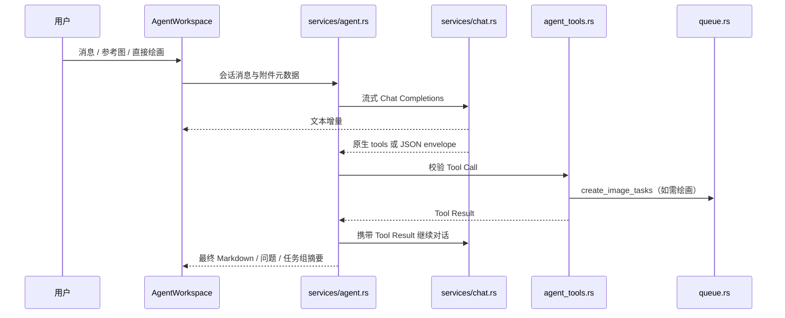
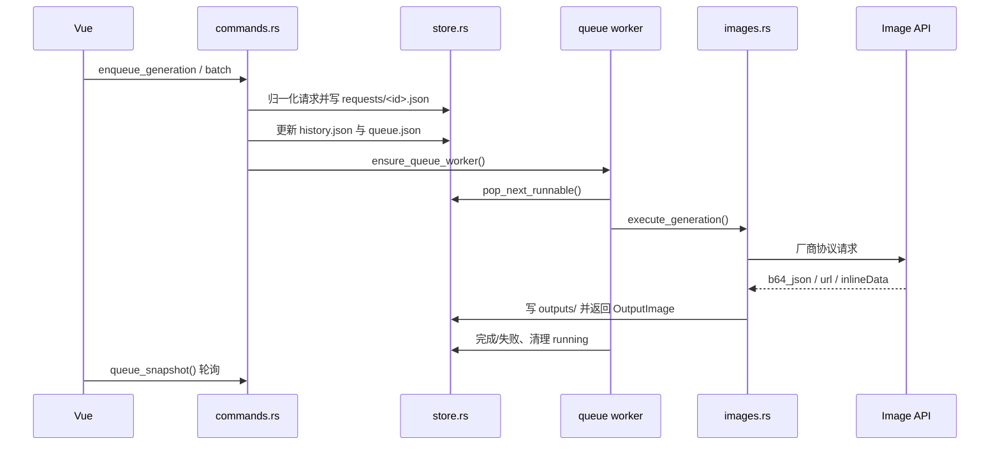

# Image Forge 技术设计

本文档描述当前实现，而不是未来路线图。Image Forge 是一款 Tauri 2 桌面应用：Vue 3 负责交互，Rust 负责本地数据、队列、协议适配、Skill 安全审查和文件生命周期。

## 设计目标与边界

### 目标

1. 让一次绘图从提示词、参考图、模型参数到结果文件都可追踪。
2. 让 Agent 能够理解任务并规划绘图，但不能绕过本地校验直接执行危险动作。
3. 用统一队列承接绘画模式和 Agent 模式，避免两套生成状态互相漂移。
4. 保持数据可读、可恢复、可迁移，不依赖传统数据库。
5. 在厂商协议差异、窗口缩放和本地资源加载上优先保证桌面运行稳定性。

### 非目标

- 不提供终端、脚本、任意文件系统、浏览器、数据库或插件执行能力。
- 不在绘画模式解析 `@skill`；Skill 只通过 Agent 工作流进入上下文。
- 不把每个模型厂商的细节泄漏到 Vue 组件中。

## 系统总览



应用只有一个业务状态源：`src/App.vue` 持有设置、历史、队列、模板、Skill、参考图、绘画表单和 Agent 会话状态；子组件通过 props 接收状态，通过事件把动作交回 `App.vue`。模式切换只改变可见工作区，不销毁另一模式的临时状态。

## 前端架构

### 页面与工作区

| 模块 | 当前职责 |
| --- | --- |
| `src/App.vue` | 启动加载、模式切换、轮询、Tauri 命令调用、绘画动作、Agent 会话动作和全局弹窗。 |
| `src/components/AppShell.vue` | 页面骨架、顶部区域、工作区切换和全局状态栏。 |
| `src/components/AppTopbar.vue` | 品牌、`绘画/Agent` 切换、API 源、模板、Skill、关于入口。 |
| `src/components/DrawingWorkspace.vue` | 绘画模式的队列、结果预览和参数工作台组合。 |
| `src/components/AgentWorkspace.vue` | Agent 会话列表、模型选择、消息列表和输入区组合。 |
| `src/components/QueuePanel.vue` | 历史任务筛选、任务卡片、刷新、重用、下载、定位和删除。 |
| `src/components/ResultPanel.vue` | 当前任务状态、输出图片、详情和重用。 |
| `src/components/ComposerPanel.vue` | 绘画模式参数、参考图、提示词和模板引用。 |
| `src/components/AgentMessageList.vue` | Markdown 回复、Tool Call 状态、交互问题和绘图任务组。 |
| `src/components/AgentComposer.vue` | Agent 输入、参考图、直接绘画开关、发送和停止。 |
| `src/components/TaskCard.vue` | 单个任务的缩略图、状态计时器和操作区。 |

### Agent 交互约束

- Agent 没有会话时，应用自动创建一个新会话。
- 左侧会话历史只展示会话，不展示 Skill；会话按时间稳定排列，不因选择而重新排序。
- 用户和 Agent 消息使用独立图标，双方名称和时间在消息角色区域展示。
- Agent 回复通过 `markdown-it` 渲染 Markdown；工具成功结果不把原始 JSON 直接塞进对话，只有错误以可换行文本显示。
- `list_skills` 的完成结果使用紧凑的单行工具卡，降低长对话高度。
- 任务组按钮预留固定边框和内边距，hover 只改变颜色，不改变盒模型尺寸。
- 输入框默认 Enter 发送，Command/Ctrl+Enter 也发送，Shift+Enter 保留换行，输入法组合态不会误发送。
- “直接绘画”位于发送按钮下方。勾选后提示词使用生图模型；未勾选时使用对话模型。
- 参考图支持文件选择、剪贴板图片、右键粘贴和拖放；剪贴板同时含图片与文本时只处理图片。

### 绘画工作区约束

- 最小窗口尺寸为 `1200×800`。
- 窗口状态保存逻辑像素尺寸；恢复时按当前显示器缩放因子换算，避免 Retina 下恢复成约一半大小。
- 生图模型和对话模型独立选择；Agent 顶部两个选择器固定为约 `200px`，生图模型在左、对话模型在右。
- 历史任务卡片固定高度和顺序，结果预览使用剩余空间；图片使用 Tauri asset protocol URL 加载。
- 所有输出路径通过 `convertFileSrc()` 转成 WebView 可访问的资源 URL。Tauri 配置显式允许 `$HOME/.image-forge/**`，因为 Unix 默认 glob 不会让 `$HOME/**` 匹配隐藏目录。

### 前端工具层

| 文件 | 职责 |
| --- | --- |
| `src/lib/models.js` | 默认设置、空模板、深拷贝和设置归一化。 |
| `src/lib/options.js` | 分辨率、比例、质量、提示词模式和像素尺寸映射。 |
| `src/lib/formatters.js` | 状态、文件名、图片 URL 和通用展示格式化。 |
| `src/lib/referenceFiles.js` | 解析剪贴板、拖放和 `file://` 本地路径。 |
| `src/lib/generationTimer.js` | 运行中任务计时和超时状态。 |
| `src/lib/scrollbarVisibility.js` | 覆盖式滚动条的显隐、拖动和布局隔离。 |
| `src/tauri.js` | Tauri invoke、文件对话框、原生拖放、窗口状态和图片资源 URL。 |

## Rust 架构

`src-tauri/src/lib.rs` 只负责模块、插件、运行状态和 Tauri 命令注册。命令层负责边界校验和组合服务，服务层负责外部 API 或后台流程，`store.rs` 负责本地文件读写。

| 模块 | 职责 |
| --- | --- |
| `commands.rs` | 前端可调用命令：设置、模板、Skill、Agent、任务和清理操作。 |
| `models.rs` | Vue 与 Rust 共享的 serde 数据结构，包括任务、输出、Agent envelope 和 Skill manifest。 |
| `state.rs` | 运行期状态：队列 worker 标记、取消/删除集合和运行日志。 |
| `store.rs` | 数据目录、JSON 读写、请求/历史/队列/模板/Skill 归一化和事务。 |
| `services/queue.rs` | 单 worker 调度、provider 并发限制、取消、重试和异常恢复。 |
| `services/images.rs` | GPT/Gemini/Grok/Seedream 请求组装、响应解析和输出落盘。 |
| `services/chat.rs` | OpenAI 兼容 Chat Completions、流式回复和模板填充。 |
| `services/agent.rs` | Agent 上下文、对话循环、Tool Call、取消和错误归一化。 |
| `services/agent_tools.rs` | 工具注册、JSON schema 校验、参数限制和工具结果。 |
| `services/agent_store.rs` | Agent 会话保存、恢复、摘要和状态迁移。 |
| `services/skill.rs` | HTTP(S)/GitHub Markdown 读取、候选 URL、大小和内容类型校验。 |
| `services/skill_installer.rs` | Skill 包审查、manifest 生成、临时目录和原子安装。 |
| `services/references.rs` | 参考图哈希去重、引用扫描和孤岛资源清理。 |
| `services/template_bundle.rs` | 模板 ZIP 导入导出、清单校验、图片哈希和兼容旧格式。 |
| `services/models.rs` | OpenAI 风格和 Gemini 原生模型列表读取。 |
| `services/clipboard.rs` | macOS Finder 文件 URL、系统剪贴板图片和资源写入。 |

## Agent 协议与工具循环

Agent 遵循“模型决策、Rust 执行、结果回传”的闭环。模型只能提出文本回复或结构化 Tool Call，Rust 端通过同一套 schema 校验后才执行。



### 工具集合

| 工具 | 作用 | 约束 |
| --- | --- | --- |
| `list_skills` | 搜索本地 Skill 摘要。 | 不返回完整正文。 |
| `install_skill` | 安装 URL、GitHub 或本地 Skill 包。 | 安装前必须通过安全审查；覆盖安装需要明确确认。 |
| `use_skill` | 读取 Skill 与 references，形成聊天回复、问题或图片计划。 | 不执行 Skill 中的命令。 |
| `create_image_tasks` | 创建单图或多图任务组。 | 计划、提示词、数量、模型和参考图策略由 Rust 校验。 |
| `get_task_status` | 查询任务或任务组状态。 | 只读。 |

Agent 不拥有终端、任意文件读写、任意网络请求、浏览器或数据库工具。Skill 的远程下载是安装器的固定流程，不是模型可以自由调用的网络能力。

### Envelope 降级协议

优先使用 Chat Completions 原生 `tools/function calling`。对不支持原生工具调用的模型，使用受限 JSON envelope：

```json
{
  "type": "assistant | tool_call | tool_result",
  "schemaVersion": 1,
  "id": "call-id",
  "name": "create_image_tasks",
  "arguments": {}
}
```

两种协议共享工具 schema、权限和错误处理。网络错误、解析错误或工具错误都会结束为可见状态，不让界面无限等待。

## 图片计划与任务组

Agent 不直接拼装内部 `GenerateRequest`，而是提交结构化图片计划：

```json
{
  "title": "阳光下的柴犬",
  "prompt": "可以直接交给生图模型的最终提示词",
  "providerId": "image-provider-id",
  "resolution": "standard",
  "ratio": "1:1",
  "quality": "high",
  "referencePolicy": "use",
  "referenceIds": ["reference-id"]
}
```

Rust 端检查提示词非空、模型类型正确、计划数量、参考图 ID、参考图策略和资源存在性。全部计划通过后才一次性写入任务组，避免多图任务只入队一半。任务会记录 `origin=agent`、`agentSessionId`、`taskGroupId`、模型和可选 Skill 哈希。

## 绘图队列与原子性



- `RuntimeState.worker_active` 保证同一进程只有一个调度循环。
- `queue.waiting` 保持任务顺序，`images_concurrency` 控制每个生图 provider 的并发。
- 任务失败可按设置自动重试一次；用户也可以手动刷新或重试。
- 应用重启时，遗留的 `running` 任务恢复到可继续处理的状态。
- Agent 多图任务使用 staged transaction：请求文件、历史记录和队列状态全部准备成功后再提交；提交失败会回滚，未提交事务启动时可恢复。

## 生图协议适配

`services/images.rs` 按 `modelType` 选择请求协议，不把厂商差异交给前端。

| 类型 | 生成 | 编辑 / 参考图 | 鉴权 |
| --- | --- | --- | --- |
| `image-gpt` | `/images/generations` JSON | `/images/edits` multipart | Bearer |
| `image-gemini` | `models/{model}:generateContent` | 同端点，`inlineData` parts | `x-goog-api-key` |
| `image-grok` | `/images/generations` JSON | `/images/edits` JSON data URL | Bearer |
| `image-seedream` | `/images/generations` JSON | generations + `image` 字段 | Bearer |
| `chat` | 不参与生图 | Chat Completions | provider 配置 |

共同规则：Base URL 归一化，代理支持 HTTP/SOCKS，模型列表有超时，响应支持 `b64_json`、URL 或 Gemini `inlineData`，文件头决定最终 `png/jpeg/webp` 格式。比例会写入提示词，分辨率和比例共同计算像素 `size`。

## Skill 安全设计

Skill 的目录形态为：

```text
skills/<safe-name>/
  SKILL.md
  manifest.json
  references/*.md
```

安装器先把内容放进临时目录，生成并校验 manifest，通过后原子移动到正式目录。允许的能力只有 `chat`、`image_plan` 和 `reference_images`。

审查包含：

- 必须存在 `SKILL.md` 或 `skill.md`；拒绝绝对路径、`..` 和符号链接。
- 只允许 Markdown 和图片参考资源；拒绝二进制、可执行文件及 `scripts/`、`script/`、`bin/`、`tools/`。
- 拒绝 Python、JavaScript、Shell、PowerShell、Ruby 等脚本扩展名。
- 检查 frontmatter、正文、Markdown 链接和代码块中的终端、脚本、子进程、下载命令和未实现能力。
- 单个 Markdown 不超过 1 MB，包体积、参考文件数量和图片大小受统一上限限制。

读取 Skill 时，后端加载 `SKILL.md` 与同包 `references/*.md`，并将参考文档明确标记为上下文边界。Skill 只能影响模型输出，不会获得执行权限。

## 本地数据与资源生命周期

```text
~/.image-forge/
  settings.json
  queue.json
  history.json
  prompt-templates.json
  skills.json
  agent/sessions/<session-id>.json
  requests/<task-id>.json
  outputs/<timestamp>-<task-id>-01.png
  references/<sha256>.<ext>
  skills/<skill-name>/SKILL.md
```

参考图进入流程后按内容 SHA-256 去重。任务、模板和 Agent 附件只保存路径或引用 ID；删除对象时扫描历史、模板、请求和会话引用，无人引用的资源才进入系统回收站。

输出图由 Tauri asset protocol 供 WebView 加载。配置中同时允许 `$HOME/**` 和 `$HOME/.image-forge/**`；后者是必要的显式规则，因为 Unix glob 默认要求隐藏目录的前导点必须出现在模式中。

## 模板包

```text
ImageForge-templates.zip
  manifest.json
  ImageForge-templates.md
  images/<sha256>.<ext>
```

导出始终包含全部模板；导入校验 manifest、路径和图片 SHA-256，重复模板跳过并重新分配本地 ID。没有新 manifest 时，会尽力兼容旧版 Markdown ZIP。导入限制压缩包、条目、解压后总大小和单图大小，避免把归档导入变成资源耗尽入口。

## 模型与设置

`settings.providers` 是统一配置列表，关键字段包括：

- `id`：内部稳定 ID，不展示给用户。
- `modelType`：`image-gpt`、`image-gemini`、`image-grok`、`image-seedream` 或 `chat`。
- `baseUrl`、`apiKey`、`proxyUrl`、`imageModel`：协议连接参数。
- `imagesConcurrency`：队列并发上限兼容字段。
- `activeImageProviderId`、`activeChatProviderId`：两个工作区的默认模型。

旧版本的 `modelType=image` 或未知类型会按模型名和 Base URL 推断协议，并在读取设置时归一化。导出 API 源时不导出内部 ID；导入会生成新 ID，并对重复配置去重。API Key 会以明文存在导出文件中，导出文件必须保存在可信位置。

## 窗口、资源协议与恢复

Tauri 窗口最小逻辑尺寸为 `1200×800`，默认尺寸为 `1360×930`。`src/tauri.js` 保存逻辑像素宽高，旧版物理像素状态会根据 `scaleFactor` 迁移；恢复时把窗口限制在当前显示器工作区内。

图片 `` 不直接使用本地文件路径，而是通过 `convertFileSrc()` 生成 asset URL。Tauri 的 asset protocol 开启并限制在用户 Home 目录范围内，隐藏的 `.image-forge` 数据目录额外显式授权。

## 开发与发布

安装与开发：

```bash
pnpm install
pnpm tauri dev
```

前端检查与构建：

```bash
pnpm test
pnpm build
```

Rust 检查：

```bash
cargo fmt --manifest-path src-tauri/Cargo.toml --check
cargo check --manifest-path src-tauri/Cargo.toml
cargo test --manifest-path src-tauri/Cargo.toml
```

版本升级与预发布：

```bash
pnpm run patch -- <next-version>
pnpm run prerelease
```

`prerelease` 会构建、签名并在 `release/` 生成当前版本 `.app`，日常开发不生成 `.dmg`。`release/` 和构建缓存不提交 Git；临时目录清理优先使用系统回收站，回收站不可用时保留并提示，不做永久删除。

## 扩展约定

- 新的 Tauri 命令进入 `commands.rs`，不要把业务逻辑塞入 `lib.rs`。
- 本地 JSON 读写进入 `store.rs`；外部 API、队列和协议进入 `services/`。
- 新增持久化文件必须同步更新本地数据章节和恢复策略。
- 新增模型协议必须同时更新 provider 归一化、模型列表、请求组装、响应解析和测试。
- 新增 Agent 工具必须同时更新 schema、权限边界、降级 envelope 和集成测试。
- UI 组件通过 props/events 与 `App.vue` 协作，避免在展示组件中直接写业务状态。
