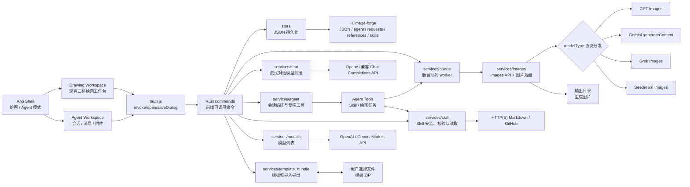
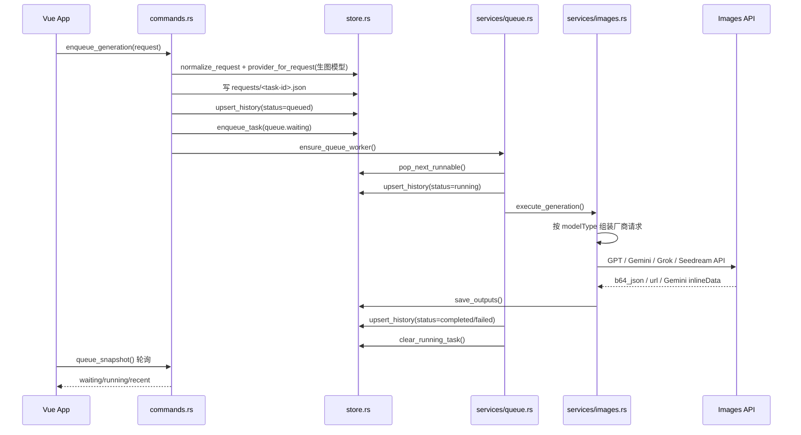
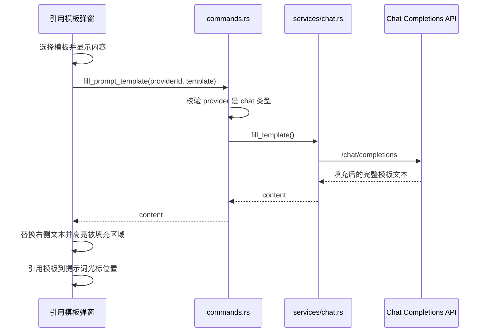
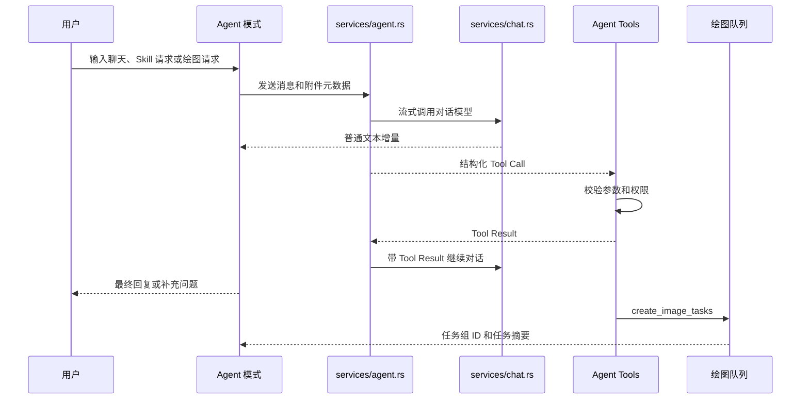
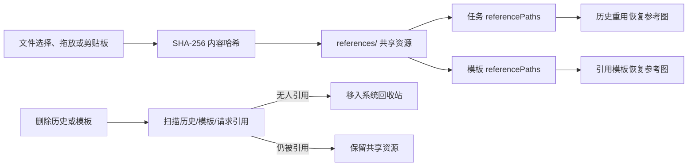
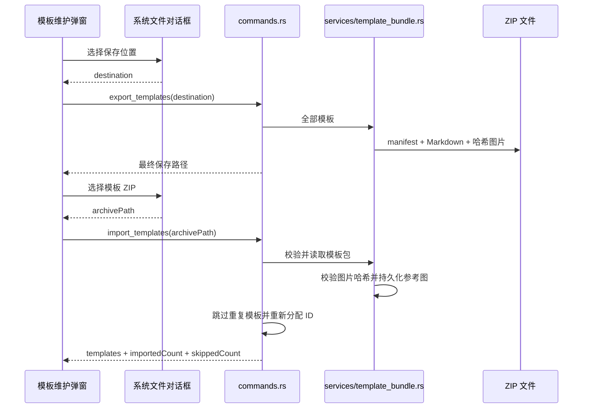
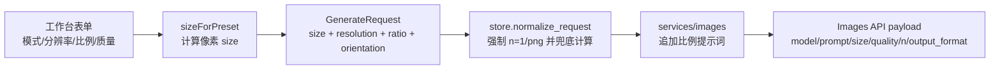

# Image Forge 技术设计

Image Forge 是一个 Tauri 2 + Vue 3 的本地 AI 图像工作台。当前产品以绘画工作台为核心，目标形态是在同一个应用中提供“绘画”和“Agent”两种模式：绘画模式负责直接生图和任务管理，Agent 模式以对话模型为主，负责普通聊天、安装和使用 Skill，并在需要绘图时调用受控工具把任务提交给现有绘画队列。

## 总览



## 前端架构

前端仍然是单页应用。下表先记录当前实现；Agent 开发开始后，`App.vue` 将收敛为模式外壳，绘画与 Agent 分别拥有独立工作区组件。

| 文件                                                   | 职责                                          |
| ---------------------------------------------------- | ------------------------------------------- |
| `src/App.vue`                                        | 页面控制器：集中管理状态、computed、Tauri 命令调用、轮询和业务动作。   |
| `src/components/AppTopbar.vue`                       | 顶部品牌、API 源、模板、Skill 和关于入口。                      |
| `src/components/QueuePanel.vue`                      | 生成历史搜索和任务列表；按显式请求执行首次加载和新增任务后的滚底。            |
| `src/components/ResultPanel.vue`                     | 当前任务状态、API 源/模型、弹性结果图片预览、详情和重用入口。                |
| `src/components/ComposerPanel.vue`                   | 生图模型选择、生成参数、提示词输入、参考图条和引用模板；绘画模式不提供 Skill 入口。           |
| `src/components/TaskCard.vue`                        | 单个历史任务卡片，负责展示结果、计时器和重用/刷新/下载/定位/重试/删除动作。    |
| `src/components/dialogs/ApiSourceDialog.vue`         | API 源/模型管理、横向排序、JSON 导入导出、克隆和编辑；内部 ID 自动生成且不展示。 |
| `src/components/dialogs/ConfirmDialog.vue`           | 删除确认弹窗：自动聚焦确认按钮，支持回车确认和 Esc 取消。                 |
| `src/components/dialogs/NoticeDialog.vue`            | 单按钮通知弹窗：用于成功、错误和超时提示，Enter 与 Esc 都关闭弹窗。       |
| `src/components/dialogs/TemplateManagerDialog.vue`   | 模板维护弹窗：搜索、手动排序、标题点击查看、提示词/参考图悬浮预览、编辑删除及导入导出入口。    |
| `src/components/dialogs/TemplateEditorDialog.vue`    | 模板新增/编辑/查看弹窗；支持标题、参考图选择、粘贴和拖放，查看模式高亮 `{}` 占位区域。 |
| `src/components/dialogs/TemplateReferenceDialog.vue` | 引用模板弹窗：搜索与标题下拉、原文/AI 结果对比编辑、临时参考图和 AI 填充。     |
| `src/components/dialogs/SkillManagerDialog.vue`      | Skill 维护弹窗：搜索、名称查看、新增、编辑和确认删除。                  |
| `src/components/dialogs/SkillEditorDialog.vue`       | Skill 维护编辑弹窗：URL 提取和固定 12 行 Markdown 编辑区。       |
| `src/components/AgentWorkspace.vue`                 | Agent 会话、Skill 选择/安装、流式回复、附件和任务组入口。       |
| `src/components/dialogs/TaskDetailDialog.vue`        | API 源/模型、三列参数表、输出图和重用入口；弹窗不超过可视区域并允许滚动。      |
| `src/components/dialogs/AboutDialog.vue`             | 版本、编译时间、应用说明和本次运行内存日志。                       |
| `src/lib/models.js`                                  | 前端默认数据结构、空草稿对象、深拷贝和设置归一化。                   |
| `src/lib/options.js`                                 | 生图参数选项和预设换算：提示词模式、分辨率、比例、质量、尺寸映射。           |
| `src/lib/formatters.js`                              | 状态标签、文件名、文件 URL、clamp 等展示工具。                |
| `src/lib/generationTimer.js`                         | 运行中任务的十分之一秒计时和五分钟超时判断。                      |
| `src/lib/referenceFiles.js`                          | 从 WebView 剪贴板和拖放数据中解析绝对路径与 `file://` URI。       |
| `src/lib/scrollbarVisibility.js`                     | 隐藏占位式原生滚动条，按滚动比例绘制可拖动的固定定位悬浮轨道，并统一控制 Naive UI 滚动条显隐。       |
| `src/lib/theme.js`                                   | Naive UI 主题覆盖。                              |
| `src/tauri.js`                                       | 对 Tauri `invoke`、文件打开/保存对话框和原生拖放事件的轻封装。                 |

### 目标前端分层

| 计划组件 | 职责 |
| --- | --- |
| `AppShell.vue` | 顶层模式切换、全局弹窗和跨模式事件；默认进入绘画模式。 |
| `DrawingWorkspace.vue` | 承接现有三栏工作台，保持提示词、参考图、模型选择和面板宽度状态。 |
| `AgentWorkspace.vue` | Agent 会话列表、消息流、输入区、附件、对话模型和工具结果卡片。 |
| `AgentMessageList.vue` | 流式消息、Tool Call 状态、Skill 安装结果和绘图任务组卡片。 |
| `AgentComposer.vue` | 普通消息输入、参考图附件、发送/停止和对话模型选择。 |

- 顶部使用分段控件 `[绘画] [Agent]`，每次启动默认选择绘画模式，不用路由刷新页面。
- 两个工作区状态相互独立。模式切换只改变可见工作区，不销毁当前绘画草稿或 Agent 会话。
- Agent 创建绘图任务后切换到绘画模式，并选中该任务组的第一项；Agent 消息中的任务卡片可以再次跳转。
- 绘画模式删除“引用 skill”、`@skill` 补全、提示词中的 Skill 解析和 `SkillRunDialog`。模板 AI 填充仍可继续使用对话模型。

### 前端数据传递

- `App.vue` 持有唯一业务状态源：`settings`、`queue`、`history`、`templates`、`skills`、`references`、`form`。
- 引用模板和使用 Skill 弹窗共用 `form.chatProviderId`；工作台质量参数下方维护 `form.providerId`，用于当前生图模型。
- 生图模型默认优先使用最近一次成功生成的模型；如果该模型不在当前列表里，默认选中第一个生图模型。
- 生成工作台只暴露五类参数：提示词模式、分辨率、比例、质量、生图模型；数量固定为 `1`，输出格式固定为 `png`。
- 前端提交前用 `sizeForPreset(resolution, ratio)` 把 `1K/2K/4K + 比例` 换算成 Images API 需要的像素尺寸。
- 展示组件通过 props 接收数据，通过 events 把动作抛回 `App.vue`。
- 表单型组件接收草稿对象并直接修改对象字段，保存动作仍由 `App.vue` 调用 Rust 命令。
- 历史、模板和 API 源删除先由 `ConfirmDialog` 确认，确认按钮自动取得焦点；回车确认、Esc 取消。参考图只从当前工作台或模板草稿中移除，不弹确认框。
- 模板保存、导入和 AI 填充的成功/失败提示使用 `NoticeDialog`，单按钮自动取得焦点，回车和 Esc 都会关闭。
- 任务与模板都保存 `referencePaths`；重用任务或引用模板时，前端重新加载缩略图并合并到工作台参考图。
- `QueuePanel` 只监听 `App.vue` 的滚动请求计数；首次状态加载和新任务入队后递增，定时队列快照不会修改用户当前浏览位置。
- 结果预览列使用 `auto + minmax(0, 1fr)` 两行网格和固定间距；失败错误文本不限制行数并允许任意位置换行，状态区随完整错误内容增高时，图片或空预览区在剩余空间内弹性收缩。
- 原生拖放事件由 `src/tauri.js` 转发到 `App.vue`；`data-reference-drop-target` 区分主工作台和模板草稿，坐标无法识别时按当前可见编辑器兜底路由。
- WebView 拖放和可见的 Finder 粘贴数据由 `referenceFiles.js` 提取本地文件路径；模板内容区和“参考图”按钮都可以接收拖放。
- macOS WebView 未暴露 Finder 文件路径时，`clipboard.rs` 读取系统粘贴板各项目的 `public.file-url`，优先预览原始图片文件，再回退到普通位图剪贴板。
- 文件路径统一交给 `reference_from_path` 读取并检查真实 MIME；只有图像文件会加入参考图，非图像路径不会写入提示词或显示错误。
- `scrollbarVisibility.js` 隐藏会占用布局宽度的原生滚动条，并在 `body` 上按容器可视边界、滚动比例和滚动位置绘制固定定位的纵向/横向悬浮轨道；轨道支持点击和拖动，不参与内容布局。滚动或靠近边缘时显示，停止滚动后以一秒动画淡出；Naive UI 继续使用自身的覆盖式轨道并复用同一显隐状态。
- WebKit 对 `textarea` 的系统滚动条使用显式选择器再次隐藏，避免多行提示词输入框同时出现系统滚动条和应用悬浮滚动条。
- 模板导出通过系统保存对话框选择 ZIP 路径；模板导入通过系统打开对话框选择 ZIP，并显示新增/跳过数量。
- API 源和模板维护共用导入导出图标语义：`Download` 表示内容进入应用，`Upload` 表示内容离开应用。
- `App.vue` 启动后调用 `load_app_state`，随后每 1.6 秒调用 `queue_snapshot` 刷新队列。

## Rust 架构

Rust 端按层拆分，`lib.rs` 只负责注册模块、插件和 Tauri 命令。

| 文件                                 | 职责                                                              |
| ---------------------------------- | --------------------------------------------------------------- |
| `src-tauri/src/lib.rs`             | Tauri 入口：注册 `RuntimeState`、dialog 插件、setup 恢复队列、invoke handler。 |
| `src-tauri/src/commands.rs`        | 前端可调用命令层：组装参数、调用 store/services、返回序列化结果。                        |
| `src-tauri/src/models.rs`          | Rust 与前端共享的 serde 数据模型。                                         |
| `src-tauri/src/defaults.rs`        | 默认值、常量、serde default 函数。                                        |
| `src-tauri/src/state.rs`           | 运行期内存状态：worker、取消/删除任务集合和最多 500 条运行日志。                            |
| `src-tauri/src/store.rs`           | JSON 文件数据库：路径管理、读写、设置/请求/历史/队列/模板/Skill 归一化。                           |
| `src-tauri/src/services/queue.rs`  | 后台队列 worker、并发调度、取消、失败重试、运行中任务恢复。                               |
| `src-tauri/src/services/images.rs` | GPT/Gemini/Grok/Seedream 协议分发、响应解析、参考图预览和生成结果落盘。                  |
| `src-tauri/src/services/chat.rs`   | 共享 OpenAI 兼容 Chat Completions 调用器，服务模板填充和 Skill 生成。                  |
| `src-tauri/src/services/models.rs` | 按类型调用 OpenAI 风格或 Gemini 原生 Models API，并去重模型 ID。                      |
| `src-tauri/src/services/skill.rs`  | 从 HTTP(S) URL 或 GitHub 提取 Markdown Skill，处理候选路径、超时和大小限制。             |
| `src-tauri/src/services/provider_bundle.rs` | API 源版本化 JSON 导出、拖入文件读取、扩展名/大小/JSON 校验。                      |
| `src-tauri/src/services/clipboard.rs` | Finder 文件 URL 与系统剪贴板图片读取、图片复制和参考图资源写入。                         |
| `src-tauri/src/services/references.rs` | 参考图按 SHA-256 去重持久化，并清理无人引用的资源。                                  |
| `src-tauri/src/services/template_bundle.rs` | 模板包 manifest/Markdown/图片的导入导出、校验、旧版兼容和安全限制。                      |
| `src-tauri/src/utils.rs`           | URL、MIME、扩展名、ID、时间、HTTP client、错误格式化等通用工具。                      |

Agent 阶段计划新增：

| 计划模块 | 职责 |
| --- | --- |
| `services/agent.rs` | 会话上下文、流式响应、Tool Call 循环、取消和错误归一化。 |
| `services/agent_tools.rs` | Agent 工具注册、参数校验、执行和结果序列化。 |
| `services/skill_installer.rs` | Skill 下载/导入、能力审查、临时目录校验和原子安装。 |
| `services/agent_store.rs` | Agent 会话、消息、摘要和 Tool Call 结果持久化。 |

## 本地数据存储

项目没有使用传统数据库。Rust 端把应用数据写入用户 Home 下的 `~/.image-forge`，用 JSON 文件、Skill Markdown 包和图片文件组成一个轻量本地数据库。应用不再使用 Tauri 的 `app_data_dir()` 作为业务数据根目录。

```text
~/.image-forge/
  settings.json
  queue.json
  history.json
  prompt-templates.json
  skills.json
  agent/
    sessions/
      <session-id>.json
  requests/
    <task-id>.json
  outputs/
    <timestamp>-<task-id>-01.png
  references/
    <sha256>.<ext>
  clipboard/
    # 兼容保留目录；剪贴板图片当前直接写入 references/
  skills/
    <skill-name>/
      SKILL.md
      references/
        *.md
```

| 数据       | 文件                        | 内容                                      |
| -------- | ------------------------- | --------------------------------------- |
| 设置/API 源 | `settings.json`           | 当前生图/对话模型、多个 provider、输出目录、自动队列、自动重试等。  |
| 队列状态     | `queue.json`              | `waiting` 任务 ID 列表、`running` 任务记录、更新时间。 |
| 历史任务     | `history.json`            | 最近任务记录，最多保留 `MAX_HISTORY_ITEMS`。        |
| 原始请求     | `requests/<task-id>.json` | 每个任务的生图参数，用于重试和恢复。                      |
| 输出图片     | `outputs/` 或设置中的输出目录      | 生成图片文件。                                 |
| 参考图资源     | `references/<sha256>.<ext>` | 任务和模板共享的参考图，按内容哈希去重。                    |
| 兼容目录      | `clipboard/`              | 旧版兼容目录；当前剪贴板图片不再写入这里。                    |
| 提示词模板    | `prompt-templates.json`   | 模板内容、参考图路径、数字自增 ID、使用次数和兼容旧字段。         |
| Markdown Skill | `skills.json` + `skills/<skill-name>/` | UUID、自动提取的名称、来源 URL、备注和时间；正文保存在 `SKILL.md`，同包 `references/*.md` 会在执行时加载。 |
| Agent 会话 | `agent/sessions/<session-id>.json` | 消息、上下文摘要、Tool Call、关联绘图任务组、创建和更新时间。 |

## 生图运行逻辑



### 队列调度规则

- `ensure_queue_worker()` 通过 `RuntimeState.worker_active` 保证同时只有一个调度循环。
- `pop_next_runnable()` 按 `queue.waiting` 顺序取任务，只选择 `modelType != chat` 的 provider，并按 provider 的 `images_concurrency` 限制并发。
- 每个任务执行前写入 `running` 状态；完成后写输出并从 `queue.running` 移除。
- 如果开启 `autoRetry`，任务第一次失败后会重新入队一次。
- App 启动时 `recover_stale_running()` 会把上次异常退出留下的 running 任务恢复到 waiting。
- 删除运行中任务时，命令层写入 `cancel_requests` 和 `deleted_tasks`，worker 在 API 调用前后检查并完成请求文件、队列和参考图清理。

## API 调用逻辑

`services/images.rs::execute_generation()` 不再假设所有厂商完全兼容 OpenAI，而是按 `modelType` 分发：

| 类型 | 文生图 | 参考图编辑 | 鉴权与关键差异 |
| --- | --- | --- | --- |
| `image-gpt` | JSON `POST <baseUrl>/images/generations` | multipart `POST <baseUrl>/images/edits` | Bearer Key；支持 OpenAI Images 的 `size/quality/n/output_format`。 |
| `image-gemini` | `POST <baseUrl>/models/{model}:generateContent` | 同一端点，参考图写入 `inlineData` parts | `x-goog-api-key`；发送 `responseModalities=[IMAGE]`、`aspectRatio` 和 `imageSize`。 |
| `image-grok` | JSON `POST <baseUrl>/images/generations` | JSON `POST <baseUrl>/images/edits` | Bearer Key；参考图使用 data URL `image`，最多 3 张，使用 `aspect_ratio/resolution`。 |
| `image-seedream` | JSON `POST <baseUrl>/images/generations` | 仍使用 generations，增加 `image` 字段 | Bearer Key；最多 14 张参考图，发送像素 `size`，Seedream 5 额外发送输出格式。 |

- Base URL 会归一化，自动去掉已填写的 `/images/generations`、`/images/edits` 或 `/models` 后缀。
- 非 Gemini API 源“获取模型”调用 `<baseUrl>/models` 并使用 Bearer Key；Gemini 使用原生 `/models`、`x-goog-api-key` 和 `models` 响应数组。
- 模型列表统一支持每个 API 源的可选 HTTP/SOCKS 代理和 30 秒超时。
- GPT/Grok/Seedream 响应解析支持 `b64_json` 和 `url`；Gemini 解析原生 `inlineData` 图片 part。
- 输出格式会根据 API 字段和文件头归一化为 `png`、`jpeg` 或 `webp`。
- 生图请求参数与 `example/codex_image/webui` 保持一致：`size` 是像素尺寸，`quality` 是 `auto/low/medium/high`，`n` 固定 `1`，`output_format` 固定 `png`。
- `resolution`、`ratio`、`orientation`、`prompt_fidelity` 会作为任务元数据保存；Rust 端也会重新归一化并在前端漏传时兜底计算 `size`。
- 发送 API 前会把比例写入模型提示词，例如 `16:9` 会追加 `将宽高比设为 16:9`，避免只靠 `size` 时模型忽略构图比例。
- `prompt_fidelity=strict` 会参考 example 的 direct Images transport，在出站 prompt 前追加保真守护指令；`original/off` 则保持用户提示词本身。

## 模板填充逻辑



- 模板新增时后端使用现有最大数字 ID 自增，从 `1` 开始；旧 UUID 模板保留但不参与数字序列。
- 模板以 `content`、`title` 和 `referencePaths` 为核心字段；`category`、`notes`、`favorite` 等旧字段继续保留以兼容已有数据。
- 新建或导入模板没有标题时，`store::normalize_template()` 从内容第一行生成标题，并取前 24 个 Unicode 字符；读取旧模板时也会执行一次迁移。
- 模板维护列表按持久化数组顺序展示，排序列通过 `move_template` 交换当前模板与可见相邻模板的位置；保存和导入只更新或追加模板，不再按数字 ID 自动重排。
- 模板列表固定表头并最多显示 12 条，标题点击打开只读查看弹窗；标题和参考图悬浮气泡使用鼠标坐标定位、显式传送到 `body` 并根据剩余空间上下翻转，避免被弹窗裁剪。提示词最多显示 12 行后滚动，参考图使用 `64×64` 缩略图；操作列只保留编辑和删除。引用模板下拉框显示标题，搜索仍支持标题、内容和数字 ID。
- 引用模板页脚的对话模型选择器固定向上展开，避免弹出菜单超出窗口底部可视区域。
- 模板可保存多个 `referencePaths`；相同图片与历史任务共享同一份哈希资源文件。
- 查看模板和引用模板预览会把 `{}` 包围的占位描述显示为浅紫色底色。
- AI 填充调用对话模型的 OpenAI 兼容 `/chat/completions`，要求模型只返回填充后的完整文本。
- 填充完成后，前端根据原模板中的 `{}` 位置推导替换后的文本范围，并继续用浅紫色底色标记。
- 引用模板弹窗临时添加的参考图不会写回模板；点击“引用模板”时，文本和当前参考图一起合并到工作台。

## Skill 设计

Skill 是不依赖外部脚本的 Markdown 包，目录规则与 Codex 一致：`skills/<skill-name>/SKILL.md`。`skills.json` 保存索引元数据，正文和可选参考文档保存在 Skill 包内。Skill 只能作为 Agent 的上下文和规划规范使用，绘画模式不解析 `@skill`。

| 字段 | 说明 |
| --- | --- |
| `id` | 后端生成的 UUID，界面不展示。 |
| `name` | 保存时从 Markdown 自动提取。 |
| `sourceUrl` | 可选来源 URL，手动录入时为空。 |
| `directory` | `skills/` 下的安全化目录名。 |
| `content` | 运行时从 `SKILL.md` 读取的完整 Markdown 内容，不作为索引正文持久化。 |
| `createdAt/updatedAt` | 创建与更新时间。 |

名称提取优先级为 YAML frontmatter 的 `name:`、第一个一级标题、第一行非空文本，最终回退为“未命名 Skill”。执行时会把同包 `references/*.md` 作为补充上下文加载，并使用 `<skill_reference>` 标记包边界。

### Skill 安装安全门

Image Forge 不提供 script sandbox，也不向 Agent 暴露终端、任意文件系统或任意网络工具。因此 `install_skill` 不能只读取 `SKILL.md` 后直接安装，必须在 Rust 端完成确定性能力审查。模型的判断不能绕过这道审查。

安装来源可以是 HTTP(S)/GitHub 中的 Markdown 包或用户拖入的本地目录。安装器先写入 `~/.image-forge/.staging/<id>/`，审查通过后再原子移动到 `skills/<skill-name>/`；审查失败删除临时目录并向 Agent 返回所有拒绝原因。

审查规则：

- 包内必须存在 `SKILL.md` 或 `skill.md`；目录、文件名和解压路径不得包含绝对路径、`..` 或符号链接。
- 只允许 Markdown 文件和图片参考资源；拒绝二进制、可执行文件以及 `scripts/`、`script/`、`bin/`、`tools/` 等脚本目录。
- 拒绝 `.py`、`.js`、`.ts`、`.mjs`、`.cjs`、`.sh`、`.bash`、`.zsh`、`.ps1`、`.bat`、`.cmd`、`.rb` 等可执行或脚本扩展名。
- 检查 frontmatter 和正文中的 `script/scripts`、`command/commands`、`shell`、`exec/executable`、`subprocess`、`runtime` 等能力声明；声明系统命令、终端、子进程、脚本运行或未实现工具时拒绝安装。
- 检查 Markdown 链接、代码块和指令性文本；如果要求运行 shell/PowerShell/Python/Node、调用终端、执行 `curl`/`wget` 下载或访问未提供的外部工具，拒绝安装，而不是把它当作普通参考文档。
- 允许的 Skill 能力只包括 `chat`、`image_plan` 和 `reference_images`。未声明能力的旧 Markdown Skill 按这三种能力处理；任何其他能力都必须拒绝并说明字段、文件或命中的文本。
- 单个 Markdown 文件最大 1 MB，整个包大小和参考文档数量受统一上限限制；内容必须是 UTF-8。

审查结果需要包含 `allowed`、`reasons` 和 `warnings`。拒绝消息必须告诉用户具体原因，例如“发现 `references/run.py`：包含脚本文件”或“frontmatter 声明 `command`：需要系统命令执行能力”。警告不能替代拒绝，也不能由 Agent 自己覆盖。

### Skill 读取与执行

Agent 调用 `use_skill` 时，后端根据 Skill ID 读取 `SKILL.md` 和 `references/*.md`，再按用户问题路由长文档章节。Skill 只能产出结构化的聊天回复、补充问题或图片计划，不能直接执行动作。图片计划必须经过本地校验后调用 `create_image_tasks`，最终复用现有绘图队列和 API 源并发控制。

## Agent 模式设计

### 模式与职责

顶栏通过分段控件切换 `[绘画] [Agent]`，应用启动默认绘画模式。两种模式共享设置、API 源、Skill 索引和任务队列，但拥有独立的临时状态：

| 模式 | 允许的操作 |
| --- | --- |
| 绘画模式 | 直接编辑提示词、参考图和参数，提交普通绘图任务，查看和管理队列；不识别 `@skill`。 |
| Agent 模式 | 普通聊天、流式回复、安装/使用 Skill、处理交互问题、创建单图或多图绘图任务。 |

Agent 产生绘图任务后，后端先返回任务组结果，前端切换到绘画模式并定位到该任务组。Agent 消息保留任务组卡片，用户可以从卡片再次进入绘画模式。

### Agent 会话流程



Agent 采用“模型决策、Rust 执行、结果回传”的循环。所有 Tool Call 都需要经过参数 schema 校验；工具执行失败只作为结果返回模型，不能让模型直接修改本地文件或绕过权限。

### 第一版工具集合

| 工具 | 参数 | 结果和限制 |
| --- | --- | --- |
| `list_skills` | 搜索词，可选 | 只返回 Skill ID、名称、备注、来源和能力摘要，不返回全部正文。 |
| `install_skill` | URL 或本地包路径 | 先执行 Skill 安全门；拒绝脚本、系统命令和未知能力；覆盖已有 Skill 前要求用户确认。 |
| `use_skill` | Skill ID、用户任务、参考图 ID | 读取包内容并规划聊天回复、补充问题或图片计划，不执行 Skill 中的命令。 |
| `create_image_tasks` | 图片计划数组、参数、参考图策略 | 本地校验提示词和数量后原子创建任务组，复用 `enqueue_generation_batch` 和 API 源并发。 |
| `get_task_status` | 任务组或任务 ID | 只读返回绘图队列和历史状态。 |

第一版不提供终端、脚本、任意文件读写、任意 HTTP 请求、浏览器、数据库或插件执行工具。Skill 安装所需的网络下载是安装器的固定能力，不是 Agent 可以自由调用的网络工具。

### 对话模型兼容策略

优先使用 OpenAI 兼容 API 的原生 `tools/function calling`。由于部分 API 源只实现了 Chat Completions 的文本和流式协议，Agent 还需要一个受限 JSON 降级协议：模型只能返回 `assistant`、`tool_call`、`tool_result` 三种 envelope，Rust 端校验后才执行工具。两种协议都使用同一套工具 schema 和权限检查，不能因为降级协议而放宽能力。

流式输出规则：普通文本增量直接显示在 Agent 消息中；Tool Call 参数未完整生成前只显示“准备调用工具”；参数校验通过后显示工具状态；工具完成后继续生成最终回复。网络错误、JSON 错误和工具错误都要以可见的助手消息结束本轮，不能让界面无限等待。

### 会话持久化与上下文

每个 Agent 会话保存到 `agent/sessions/<session-id>.json`，至少包含：

- 消息角色、文本、附件引用和时间；
- 使用的对话模型 ID；
- Tool Call、参数摘要、结果摘要和错误；
- Skill ID、Skill 内容哈希和安全审查结果；
- 关联的 `taskGroupId`、任务 ID 和创建时间；
- 上下文摘要和当前会话状态。

长对话超过上下文预算时，后端先保留最近消息、未完成 Tool Call 和任务结果，再生成摘要；摘要不能替代原始会话记录。用户关闭窗口后可以从会话列表恢复 Agent 对话，但恢复不会自动重复执行已经完成的 Tool Call。

### 图片计划与绘图模式

`create_image_tasks` 接受结构化图片计划，而不是让 Agent 直接拼装内部 `GenerateRequest`。每个输出必须包含标题、最终提示词、分辨率/比例/质量和参考图策略：

```json
{
  "title": "第一张图",
  "prompt": "可以直接交给生图模型的提示词",
  "referencePolicy": "use | optional | none",
  "referenceIds": []
}
```

后端检查：提示词非空、图片数量在上限内、参考图 ID 属于当前会话、`none` 不携带参考图、`use` 的资源真实存在。所有计划验证通过后才一次性创建任务组，避免多图只入队一半。任务记录增加 `origin=agent`、`agentSessionId`、`taskGroupId` 和可选 `skillId`，但普通绘画任务仍使用原有流程。

绘画模式不再解析 `@skill`。用户如果在绘画模式输入 `@xxx`，它只是普通提示词文本；Skill 相关能力必须切换到 Agent 模式完成。

### Agent 交互与确认

- 信息不足时，Agent 留在 Agent 模式，通过消息内表单或弹窗提问；不创建不完整绘图任务。
- 明确的用户绘图请求可以自动提交任务；高数量、多组任务、覆盖安装 Skill 和删除操作必须先显示确认界面。
- Agent 可以给出“查看绘画”操作，但模式切换不会自动关闭未完成的 Agent 会话。
- 用户取消 Tool Call 或关闭 Agent 对话时，后端设置取消令牌；已提交的绘图任务继续由队列管理，未提交的计划不落盘。

## 参考图生命周期



- `persist_reference_paths()` 读取图片内容并按 SHA-256 保存，因此多个任务或模板引用同一图片时不会产生副本。
- `prune_unreferenced_files()` 同时扫描 `history.json`、`prompt-templates.json` 和 `requests/*.json`。
- 删除历史记录会把生成结果和无人引用的参考图移入系统回收站；删除模板只清理无人引用的参考图。
- 运行中任务被删除时会延后参考图清理，避免后台请求仍在读取文件。

## 模板包导入导出

### 包目录

```text
ImageForge-templates.zip
  manifest.json
  ImageForge-templates.md
  images/
    <sha256>.png
    <sha256>.jpg
```

- `manifest.json` 是机器读取的稳定接口，保存包格式、格式版本、导出时间和模板数组。
- `ImageForge-templates.md` 面向人工查看和复制，按模板 ID 列出完整提示词及图片相对路径。
- `images/` 使用图片内容的 SHA-256 作为文件名；多个模板引用同一图片时只写入一份。

`manifest.json` 核心结构：

```json
{
  "format": "image-forge-template-bundle",
  "version": 1,
  "exportedAt": "2026-07-15T00:00:00Z",
  "templates": [
    {
      "sourceId": "12",
      "title": "示例模板",
      "content": "提示词内容",
      "references": ["images/<sha256>.png"]
    }
  ]
}
```

`sourceId` 只用于追踪来源。导入时不复用它，而是从当前模板最大数字 ID 继续自增，避免覆盖本地模板。

### 运行流程



- 导出不受模板维护搜索条件影响，始终包含全部模板。
- 新格式优先读取 `manifest.json`；没有 manifest 时，会尽力解析 `0.2.34` 生成的旧版 Markdown ZIP。
- 模板去重签名由标题、完整提示词和排序去重后的参考图资源路径组成；同时检查本地现有模板和同一 ZIP 中较早导入的模板，完全相同的模板不会重复导入。完成后通过 `NoticeDialog` 显示导入数和重复数。
- 导入限制压缩包为 256 MB、最多 2,000 个条目、解压后最多 1 GB，单图最多 100 MB。
- 所有 manifest 图片路径必须位于 `images/`，不得包含绝对路径或 `..`，并校验文件名 SHA-256 与图片内容一致。

### 生图参数映射

| UI 字段 | 前端值                                | API/存储字段                | 说明                                                    |
| ----- | ---------------------------------- | ----------------------- | ----------------------------------------------------- |
| 提示词模式 | `original` / `strict` / `off`      | `prompt_fidelity`       | 原始模式、保真模式、创意模式；`strict` 只在 Images API 出站前包装 prompt。         |
| 分辨率   | `standard` / `2k` / `4k`           | `resolution`            | UI 显示为 `1K`、`2K`、`4K`。                                |
| 比例    | `1:1` 等 11 种比例                     | `ratio` / `orientation` | `orientation` 自动归类为 `square`、`portrait`、`landscape`。  |
| 质量    | `auto` / `low` / `medium` / `high` | `quality`               | UI 显示为自动、低、中、高。                                       |
| 数量    | 固定 `1`                             | `n` / `count`           | UI 不再展示，Rust 端也强制归一化为 `1`。                            |
| 输出格式  | 固定 `png`                           | `output_format`         | UI 不再展示，Rust 端也强制归一化为 `png`。                          |



## 模型选择设计

`settings.providers` 是统一模型配置列表，每个条目用 `modelType` 区分协议：

- `image-gpt`：OpenAI Images 风格。
- `image-gemini`：Gemini 原生 `generateContent` 图片协议。
- `image-grok`：xAI Grok 图片生成/编辑协议。
- `image-seedream`：Seedream 图片生成协议。
- `chat`：OpenAI 兼容 Chat Completions，用于模板填充和 Skill 生成。

关键字段：

| 字段                      | 说明                                |
| ----------------------- | --------------------------------- |
| `id`                    | 内部稳定 ID，前端自动随机生成，供应商维护弹窗不展示。      |
| `modelType`             | 五种协议类型之一；新增 API 源时按模型名/Base URL 推荐。 |
| `imageModel`            | 当前仍作为通用模型 ID 字段，生图和对话模型都复用它。      |
| `proxyUrl`              | 单个 API 源的可选 HTTP/SOCKS 代理地址。             |
| `imagesConcurrency`     | 兼容字段；当前界面和归一化逻辑固定为 `1`。              |
| `activeImageProviderId` | 当前默认生图模型。                         |
| `activeChatProviderId`  | 当前默认对话模型。                         |
| `activeProviderId`      | 旧字段，继续保留为生图模型兼容字段。                |

旧版 `modelType=image` 或未知类型在 `store::normalize_model_type()` 中按模型名和 Base URL 推断：包含 Gemini/Imagen/Nano Banana、Grok/x.ai、Seedream/Volcengine/Ark 特征时迁移到对应类型，其余迁移为 `image-gpt`。读取设置后会把归一化结果写回 `settings.json`。新增 API 源和尚未手动指定协议的编辑草稿会自动推荐类型；用户手动选择类型后，修改模型名不会覆盖选择。

API 源卡片按五种类型使用不同底色，帮助快速区分协议。协议类型是调用行为的一部分，不只是展示标签；错误分类会直接导致请求端点、鉴权头或请求体不匹配。

API 源卡片按配置数组顺序横向排列，固定宽度为 `180px`、最小高度约 `170px`，外层横向列表保留约 `190px` 高度，确保四行信息和底部操作区完整显示；溢出时只允许水平滚动。左右排序按钮直接调整数组顺序。卡片使用标题、模型类型、模型名称、脱敏密钥、操作区五行结构，密钥不显示字段前缀，只保留前后各 6 个字符。JSON 导入导出规则如下：

- 导出格式为 `image-forge-api-sources` v1，包含 `exportedAt` 和 `providers` 数组。
- 每个导出条目保存名称、模型类型、Base URL、API Key、代理、模型和启用状态，不导出内部 `id`。
- 导入时为每个条目生成新的随机 ID，并兼容版本化格式、provider 数组和既有 KiloCode/OpenAI 对象格式。
- 导入去重忽略内部随机 ID 和固定兼容字段，对名称、模型类型、Base URL、API Key、代理地址、模型和启用状态生成签名；同时检查现有列表和同批 JSON 内的重复条目，完成后通过 `NoticeDialog` 显示导入数和重复数。
- Finder 拖入由 Tauri 原生拖放事件读取路径，HTML5 drop 作为浏览器预览兼容；仅接收最大 5 MB 的有效 `.json` 文件。导入文本框固定为 12 行，长内容在框内滚动。
- 导出文件包含明文 API Key，用户需要将文件保存在可信位置。

## 开发约定

- 新的 UI 面板优先放入 `src/components/`，弹窗放 `src/components/dialogs/`。
- 新的前端默认数据结构放 `src/lib/models.js`，展示格式化放 `src/lib/formatters.js`。
- 新的 Tauri 命令放 `src-tauri/src/commands.rs`，不要直接塞进 `lib.rs`。
- 会访问本地 JSON 的逻辑放 `store.rs`；会请求外部 API 或执行后台任务的逻辑放 `services/`。
- 模板归档等纯文件业务放入独立 service，命令层只负责读取状态和返回结果。
- 新增持久化文件时，同步更新本文档的“本地数据存储”章节。

## 开发信息

安装依赖：

```bash
pnpm install
```

启动完整 Tauri 桌面开发模式：

```bash
pnpm tauri dev
```

只查看 Vue 前端界面：

```bash
pnpm run dev
```

Vite 调试服务默认运行在 `http://127.0.0.1:1421`。浏览器里没有 Tauri 桌面运行时，所以调用本地文件、弹窗、队列命令等桌面能力会报错；需要完整功能调试时使用 `pnpm tauri dev`。

## 检查

常用检查：

```bash
pnpm build
cd src-tauri
cargo fmt --check
cargo check
cargo test
```

## 发布

单独升级版本：

```bash
pnpm run patch -- <next-version>
```

打正式包：

```bash
pnpm run release -- <next-version>
pnpm run release
```

生成日常开发预发布 App（不生成 DMG）：

```bash
pnpm run prerelease
pnpm run prerelease -- <next-version>
```

`prerelease` 只生成带版本号的 `.app`。构建成功后，会先把 `release/` 目录中的现有文件全部移入系统回收站，再放入本次 `.app`。

传入版本号时会先检查新版本必须高于当前版本，再同步修改项目版本、窗口 title、页面 title 和 Rust User-Agent；不传版本号时使用当前版本。正式发布仍可使用 `release` 生成 `.app` 和 `.dmg`；日常预发布使用 `prerelease`，只保留当前带版本号的 `.app`。`release/` 不提交进 Git。


## Git 与版本规则

- 本项目使用 PNPM 管理前端依赖；
- 代码提交遵循 Conventional Commits，例如 `feat: 增加队列工作台`；
- 每次会话提交代码时都需要升级版本，并把版本差异写入本 README；
- 每次开发会话使用 `prerelease` 产出带版本号的 `.app` 到 `release/`，不生成 `.dmg`，且不提交二进制产物。
