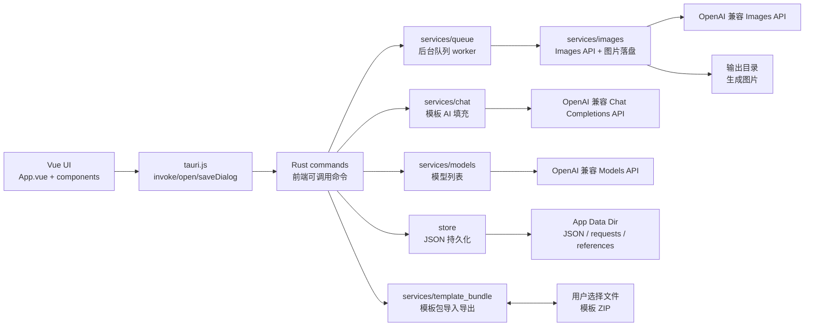
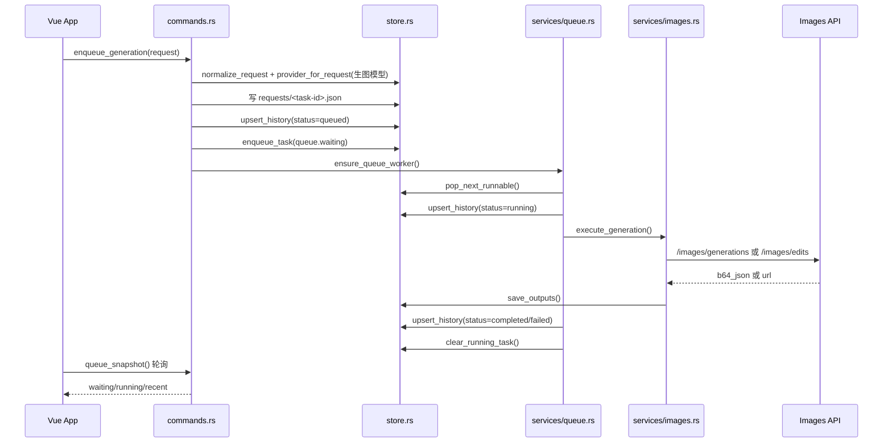
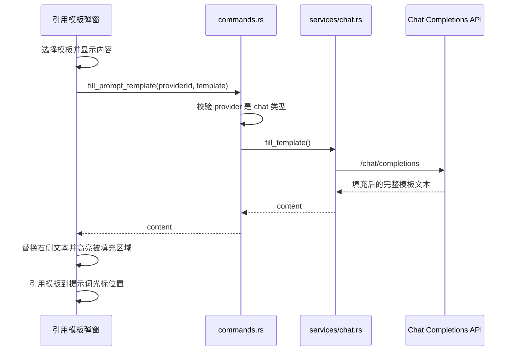
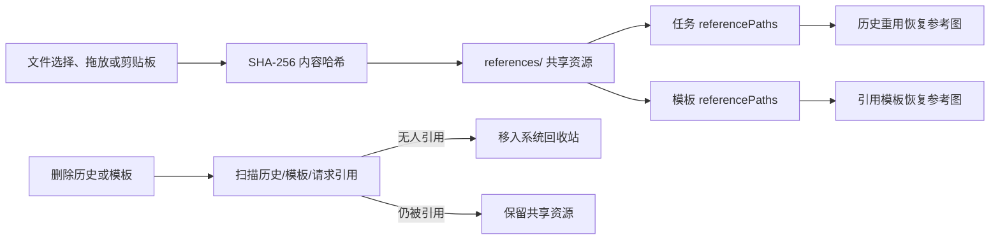
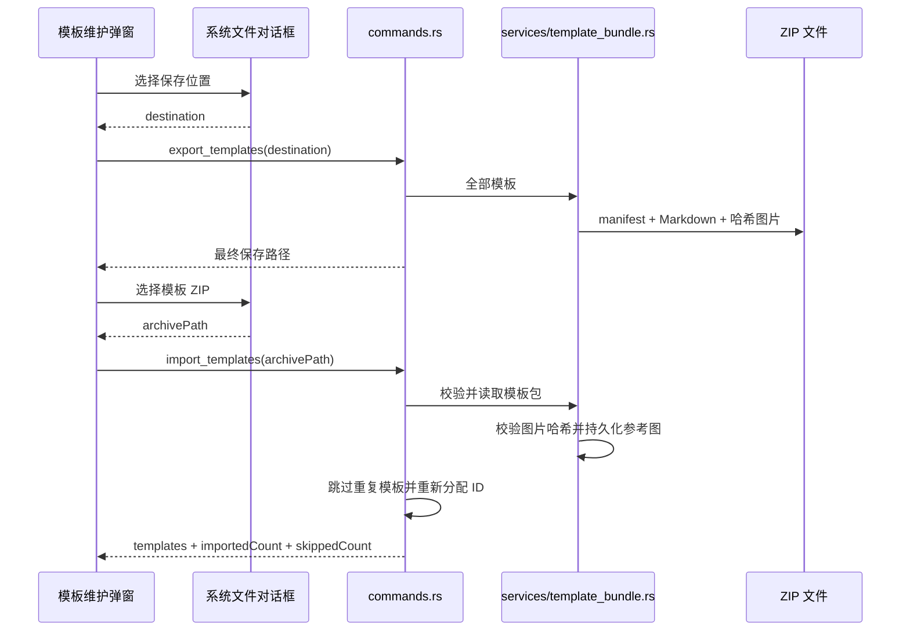
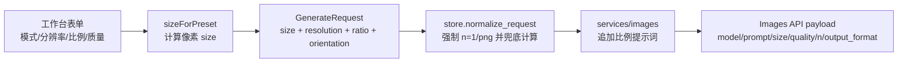

# Image Forge 技术设计

Image Forge 是一个 Tauri 2 + Vue 3 的本地生图工作台。前端负责工作台交互和状态展示，Rust 端负责本地文件持久化、队列调度、Images API 请求和系统能力调用。

## 总览



## 前端架构

前端仍然是单页应用，但 UI 已拆成可维护的单文件组件，所有组件都使用 Vue Template 语法。

| 文件                                                   | 职责                                          |
| ---------------------------------------------------- | ------------------------------------------- |
| `src/App.vue`                                        | 页面控制器：集中管理状态、computed、Tauri 命令调用、轮询和业务动作。   |
| `src/components/AppTopbar.vue`                       | 顶部品牌、API 源、模板维护和关于入口。                      |
| `src/components/QueuePanel.vue`                      | 生成历史搜索和任务列表；按显式请求执行首次加载和新增任务后的滚底。            |
| `src/components/ResultPanel.vue`                     | 当前任务状态、API 源/模型、弹性结果图片预览、详情和重用入口。                |
| `src/components/ComposerPanel.vue`                   | 生图模型选择、生成参数、提示词输入、参考图条、存为模板和引用模板入口。           |
| `src/components/TaskCard.vue`                        | 单个历史任务卡片，负责展示结果、计时器和重用/刷新/下载/定位/重试/删除动作。    |
| `src/components/dialogs/ApiSourceDialog.vue`         | API 源/模型管理、横向排序、JSON 导入导出、克隆和编辑；内部 ID 自动生成且不展示。 |
| `src/components/dialogs/ConfirmDialog.vue`           | 删除确认弹窗：自动聚焦确认按钮，支持回车确认和 Esc 取消。                 |
| `src/components/dialogs/NoticeDialog.vue`            | 单按钮通知弹窗：用于成功、错误和超时提示，Enter 与 Esc 都关闭弹窗。       |
| `src/components/dialogs/TemplateManagerDialog.vue`   | 模板维护弹窗：搜索、标题/参考图数量列表、查看/编辑/删除、新增、导入和导出入口。    |
| `src/components/dialogs/TemplateEditorDialog.vue`    | 模板新增/编辑/查看弹窗；支持标题、参考图选择、粘贴和拖放，查看模式高亮 `{}` 占位区域。 |
| `src/components/dialogs/TemplateReferenceDialog.vue` | 引用模板弹窗：搜索与标题下拉、原文/AI 结果对比编辑、临时参考图和 AI 填充。     |
| `src/components/dialogs/TaskDetailDialog.vue`        | API 源/模型、三列参数表、输出图和重用入口；弹窗不超过可视区域并允许滚动。      |
| `src/components/dialogs/AboutDialog.vue`             | 版本、编译时间、应用说明和本次运行内存日志。                       |
| `src/lib/models.js`                                  | 前端默认数据结构、空草稿对象、深拷贝和设置归一化。                   |
| `src/lib/options.js`                                 | 生图参数选项和预设换算：提示词模式、分辨率、比例、质量、尺寸映射。           |
| `src/lib/formatters.js`                              | 状态标签、文件名、文件 URL、clamp 等展示工具。                |
| `src/lib/generationTimer.js`                         | 运行中任务的十分之一秒计时和五分钟超时判断。                      |
| `src/lib/referenceFiles.js`                          | 从 WebView 剪贴板和拖放数据中解析绝对路径与 `file://` URI。       |
| `src/lib/theme.js`                                   | Naive UI 主题覆盖。                              |
| `src/tauri.js`                                       | 对 Tauri `invoke`、文件打开/保存对话框和原生拖放事件的轻封装。                 |

### 前端数据传递

- `App.vue` 持有唯一业务状态源：`settings`、`queue`、`history`、`templates`、`references`、`form`。
- 引用模板弹窗维护 `form.chatProviderId`，用于 AI 填充；工作台质量参数下方维护 `form.providerId`，用于当前生图模型。
- 生图模型默认优先使用最近一次成功生成的模型；如果该模型不在当前列表里，默认选中第一个生图模型。
- 生成工作台只暴露五类参数：提示词模式、分辨率、比例、质量、生图模型；数量固定为 `1`，输出格式固定为 `png`。
- 前端提交前用 `sizeForPreset(resolution, ratio)` 把 `1K/2K/4K + 比例` 换算成 Images API 需要的像素尺寸。
- 展示组件通过 props 接收数据，通过 events 把动作抛回 `App.vue`。
- 表单型组件接收草稿对象并直接修改对象字段，保存动作仍由 `App.vue` 调用 Rust 命令。
- 历史、模板和 API 源删除先由 `ConfirmDialog` 确认，确认按钮自动取得焦点；回车确认、Esc 取消。参考图只从当前工作台或模板草稿中移除，不弹确认框。
- 模板保存、导入和 AI 填充的成功/失败提示使用 `NoticeDialog`，单按钮自动取得焦点，回车和 Esc 都会关闭。
- 任务与模板都保存 `referencePaths`；重用任务或引用模板时，前端重新加载缩略图并合并到工作台参考图。
- `QueuePanel` 只监听 `App.vue` 的滚动请求计数；首次状态加载和新任务入队后递增，定时队列快照不会修改用户当前浏览位置。
- 结果预览列使用 `auto + minmax(0, 1fr)` 两行网格和固定间距，状态区随错误内容增高时，图片或空预览区在剩余空间内弹性收缩。
- 原生拖放事件由 `src/tauri.js` 转发到 `App.vue`；`data-reference-drop-target` 区分主工作台和模板草稿，坐标无法识别时按当前可见编辑器兜底路由。
- WebView 拖放和可见的 Finder 粘贴数据由 `referenceFiles.js` 提取本地文件路径；模板内容区和“参考图”按钮都可以接收拖放。
- macOS WebView 未暴露 Finder 文件路径时，`clipboard.rs` 读取系统粘贴板各项目的 `public.file-url`，优先预览原始图片文件，再回退到普通位图剪贴板。
- 文件路径统一交给 `reference_from_path` 读取并检查真实 MIME；只有图像文件会加入参考图，非图像路径不会写入提示词或显示错误。
- 模板导出通过系统保存对话框选择 ZIP 路径；模板导入通过系统打开对话框选择 ZIP，并显示新增/跳过数量。
- `App.vue` 启动后调用 `load_app_state`，随后每 1.6 秒调用 `queue_snapshot` 刷新队列。

## Rust 架构

Rust 端按层拆分，`lib.rs` 只负责注册模块、插件和 Tauri 命令。

| 文件                                 | 职责                                                              |
| ---------------------------------- | --------------------------------------------------------------- |
| `src-tauri/src/lib.rs`             | Tauri 入口：注册 `RuntimeState`、dialog 插件、setup 恢复队列、invoke handler。 |
| `src-tauri/src/commands.rs`        | 前端可调用命令层：组装参数、调用 store/services、返回序列化结果。                        |
| `src-tauri/src/models.rs`          | Rust 与前端共享的 serde 数据模型。                                         |
| `src-tauri/src/defaults.rs`        | 默认值、常量、serde default 函数。                                        |
| `src-tauri/src/state.rs`           | 运行期内存状态：worker、取消/删除任务集合和最多 500 条运行日志。                            |
| `src-tauri/src/store.rs`           | JSON 文件数据库：路径管理、读写、设置/请求/历史/队列/模板归一化。                           |
| `src-tauri/src/services/queue.rs`  | 后台队列 worker、并发调度、取消、失败重试、运行中任务恢复。                               |
| `src-tauri/src/services/images.rs` | Images API 请求、编辑/生成分支、响应解析、参考图预览、生成结果落盘。                        |
| `src-tauri/src/services/chat.rs`   | Chat Completions API 模板填充、代理、超时和运行日志。                                |
| `src-tauri/src/services/models.rs` | 调用 `<baseUrl>/models` 获取并去重模型 ID。                                      |
| `src-tauri/src/services/provider_bundle.rs` | API 源版本化 JSON 导出、拖入文件读取、扩展名/大小/JSON 校验。                      |
| `src-tauri/src/services/clipboard.rs` | Finder 文件 URL 与系统剪贴板图片读取、图片复制和参考图资源写入。                         |
| `src-tauri/src/services/references.rs` | 参考图按 SHA-256 去重持久化，并清理无人引用的资源。                                  |
| `src-tauri/src/services/template_bundle.rs` | 模板包 manifest/Markdown/图片的导入导出、校验、旧版兼容和安全限制。                      |
| `src-tauri/src/utils.rs`           | URL、MIME、扩展名、ID、时间、HTTP client、错误格式化等通用工具。                      |

## 本地数据存储

项目没有使用传统数据库。Rust 端把应用数据写入 Tauri 的 `app_data_dir()`，用 JSON 文件和图片文件组成一个轻量本地数据库。

```text
app_data_dir/
  settings.json
  queue.json
  history.json
  prompt-templates.json
  requests/
    <task-id>.json
  outputs/
    <timestamp>-<task-id>-01.png
  references/
    <sha256>.<ext>
  clipboard/
    # 兼容保留目录；剪贴板图片当前直接写入 references/
```

| 数据       | 文件                        | 内容                                      |
| -------- | ------------------------- | --------------------------------------- |
| 设置/API 源 | `settings.json`           | 当前生图/对话模型、多个 provider、输出目录、自动队列、自动重试等。  |
| 队列状态     | `queue.json`              | `waiting` 任务 ID 列表、`running` 任务记录、更新时间。 |
| 历史任务     | `history.json`            | 最近任务记录，最多保留 `MAX_HISTORY_ITEMS`。        |
| 原始请求     | `requests/<task-id>.json` | 每个任务的生图参数，用于重试和恢复。                      |
| 输出图片     | `outputs/` 或设置中的输出目录      | 生成图片文件。                                 |
| 参考图资源     | `references/<sha256>.<ext>` | 任务和模板共享的参考图，按内容哈希去重。                    |
| 兼容目录      | `clipboard/`              | 旧版兼容目录；当前剪贴板图片不再写入这里。                    |
| 提示词模板    | `prompt-templates.json`   | 模板内容、参考图路径、数字自增 ID、使用次数和兼容旧字段。         |

## 生图运行逻辑



### 队列调度规则

- `ensure_queue_worker()` 通过 `RuntimeState.worker_active` 保证同时只有一个调度循环。
- `pop_next_runnable()` 按 `queue.waiting` 顺序取任务，只选择 `modelType=image` 的 provider，并按 provider 的 `images_concurrency` 限制并发。
- 每个任务执行前写入 `running` 状态；完成后写输出并从 `queue.running` 移除。
- 如果开启 `autoRetry`，任务第一次失败后会重新入队一次。
- App 启动时 `recover_stale_running()` 会把上次异常退出留下的 running 任务恢复到 waiting。
- 删除运行中任务时，命令层写入 `cancel_requests` 和 `deleted_tasks`，worker 在 API 调用前后检查并完成请求文件、队列和参考图清理。

## API 调用逻辑

- 无参考图且无 mask：调用 `<baseUrl>/images/generations`。
- 有参考图或 mask：调用 `<baseUrl>/images/edits`，通过 multipart 上传图片。
- Base URL 会归一化，自动去掉 `/images/generations` 或 `/images/edits` 后缀。
- API 源“获取模型”调用 `<baseUrl>/models`，携带 Bearer API Key、可选代理和 30 秒超时。
- 响应支持 `b64_json` 和 `url` 两种图像返回方式。
- 输出格式会根据 API 字段和文件头归一化为 `png`、`jpeg` 或 `webp`。
- 生图请求参数与 `example/codex_image/webui` 保持一致：`size` 是像素尺寸，`quality` 是 `auto/low/medium/high`，`n` 固定 `1`，`output_format` 固定 `png`。
- `resolution`、`ratio`、`orientation`、`prompt_fidelity` 会作为任务元数据保存；Rust 端也会重新归一化并在前端漏传时兜底计算 `size`。
- 发送 API 前会把比例写入模型提示词，例如 `16:9` 会追加 `将宽高比设为 16:9`，避免只靠 `size` 时模型忽略构图比例。
- `prompt_fidelity=strict` 会参考 example 的 direct Images transport，在出站 prompt 前追加保真守护指令；`original/off` 则保持用户提示词本身。

## 模板填充逻辑



- 模板新增时后端使用现有最大数字 ID 自增，从 `1` 开始；旧 UUID 模板保留但不参与数字序列。
- 模板以 `content`、`title` 和 `referencePaths` 为核心字段；`category`、`notes`、`favorite` 等旧字段继续保留以兼容已有数据。
- 新建或导入模板没有标题时，`store::normalize_template()` 从内容第一行生成标题，并取前 24 个 Unicode 字符；读取旧模板时也会执行一次迁移。
- 模板维护列表只展示标题和参考图数量，查看/编辑/删除等操作仍在操作列中；引用模板下拉框显示标题，搜索仍支持标题、内容和数字 ID。
- 引用模板页脚的对话模型选择器固定向上展开，避免弹出菜单超出窗口底部可视区域。
- 模板可保存多个 `referencePaths`；相同图片与历史任务共享同一份哈希资源文件。
- 查看模板和引用模板预览会把 `{}` 包围的占位描述显示为浅紫色底色。
- AI 填充调用对话模型的 OpenAI 兼容 `/chat/completions`，要求模型只返回填充后的完整文本。
- 填充完成后，前端根据原模板中的 `{}` 位置推导替换后的文本范围，并继续用浅紫色底色标记。
- 引用模板弹窗临时添加的参考图不会写回模板；点击“引用模板”时，文本和当前参考图一起合并到工作台。

## 参考图生命周期



- `persist_reference_paths()` 读取图片内容并按 SHA-256 保存，因此多个任务或模板引用同一图片时不会产生副本。
- `prune_unreferenced_files()` 同时扫描 `history.json`、`prompt-templates.json` 和 `requests/*.json`。
- 删除历史记录会把生成结果和无人引用的参考图移入系统回收站；删除模板只清理无人引用的参考图。
- 运行中任务被删除时会延后参考图清理，避免后台请求仍在读取文件。

## 模板包导入导出

### 包目录

```text
ImageForge-templates.zip
  manifest.json
  ImageForge-templates.md
  images/
    <sha256>.png
    <sha256>.jpg
```

- `manifest.json` 是机器读取的稳定接口，保存包格式、格式版本、导出时间和模板数组。
- `ImageForge-templates.md` 面向人工查看和复制，按模板 ID 列出完整提示词及图片相对路径。
- `images/` 使用图片内容的 SHA-256 作为文件名；多个模板引用同一图片时只写入一份。

`manifest.json` 核心结构：

```json
{
  "format": "image-forge-template-bundle",
  "version": 1,
  "exportedAt": "2026-07-15T00:00:00Z",
  "templates": [
    {
      "sourceId": "12",
      "title": "示例模板",
      "content": "提示词内容",
      "references": ["images/<sha256>.png"]
    }
  ]
}
```

`sourceId` 只用于追踪来源。导入时不复用它，而是从当前模板最大数字 ID 继续自增，避免覆盖本地模板。

### 运行流程



- 导出不受模板维护搜索条件影响，始终包含全部模板。
- 新格式优先读取 `manifest.json`；没有 manifest 时，会尽力解析 `0.2.34` 生成的旧版 Markdown ZIP。
- 模板去重签名由完整提示词和排序后的参考图资源路径组成；完全相同的模板不会重复导入。
- 导入限制压缩包为 256 MB、最多 2,000 个条目、解压后最多 1 GB，单图最多 100 MB。
- 所有 manifest 图片路径必须位于 `images/`，不得包含绝对路径或 `..`，并校验文件名 SHA-256 与图片内容一致。

### 生图参数映射

| UI 字段 | 前端值                                | API/存储字段                | 说明                                                    |
| ----- | ---------------------------------- | ----------------------- | ----------------------------------------------------- |
| 提示词模式 | `original` / `strict` / `off`      | `prompt_fidelity`       | 原始模式、保真模式、创意模式；`strict` 只在 Images API 出站前包装 prompt。         |
| 分辨率   | `standard` / `2k` / `4k`           | `resolution`            | UI 显示为 `1K`、`2K`、`4K`。                                |
| 比例    | `1:1` 等 11 种比例                     | `ratio` / `orientation` | `orientation` 自动归类为 `square`、`portrait`、`landscape`。  |
| 质量    | `auto` / `low` / `medium` / `high` | `quality`               | UI 显示为自动、低、中、高。                                       |
| 数量    | 固定 `1`                             | `n` / `count`           | UI 不再展示，Rust 端也强制归一化为 `1`。                            |
| 输出格式  | 固定 `png`                           | `output_format`         | UI 不再展示，Rust 端也强制归一化为 `png`。                          |



## 模型选择设计

`settings.providers` 仍然是统一模型配置列表，每个条目用 `modelType` 区分用途：

- `image`：生图模型，参与生图队列和 Images API 调用。
- `chat`：对话模型，引用模板弹窗可选择，用于“AI 填充”模板中的 `{}` 占位区域。

关键字段：

| 字段                      | 说明                                |
| ----------------------- | --------------------------------- |
| `id`                    | 内部稳定 ID，前端自动随机生成，供应商维护弹窗不展示。      |
| `modelType`             | `image` 或 `chat`；新增和导入默认 `image`。 |
| `imageModel`            | 当前仍作为通用模型 ID 字段，生图和对话模型都复用它。      |
| `proxyUrl`              | 单个 API 源的可选 HTTP/SOCKS 代理地址。             |
| `imagesConcurrency`     | 兼容字段；当前界面和归一化逻辑固定为 `1`。              |
| `activeImageProviderId` | 当前默认生图模型。                         |
| `activeChatProviderId`  | 当前默认对话模型。                         |
| `activeProviderId`      | 旧字段，继续保留为生图模型兼容字段。                |

API 源卡片按配置数组顺序横向排列，固定宽度为 `180px`，溢出时只允许水平滚动；左右排序按钮直接调整数组顺序。卡片使用标题、模型类型、模型名称、脱敏 Key、操作区五行结构，Key 只显示前后各 6 个字符。JSON 导入导出规则如下：

- 导出格式为 `image-forge-api-sources` v1，包含 `exportedAt` 和 `providers` 数组。
- 每个导出条目保存名称、模型类型、Base URL、API Key、代理、模型和启用状态，不导出内部 `id`。
- 导入时为每个条目生成新的随机 ID，并兼容版本化格式、provider 数组和既有 KiloCode/OpenAI 对象格式。
- Finder 拖入由 Tauri 原生拖放事件读取路径，HTML5 drop 作为浏览器预览兼容；仅接收最大 5 MB 的有效 `.json` 文件。
- 导出文件包含明文 API Key，用户需要将文件保存在可信位置。

## 开发约定

- 新的 UI 面板优先放入 `src/components/`，弹窗放 `src/components/dialogs/`。
- 新的前端默认数据结构放 `src/lib/models.js`，展示格式化放 `src/lib/formatters.js`。
- 新的 Tauri 命令放 `src-tauri/src/commands.rs`，不要直接塞进 `lib.rs`。
- 会访问本地 JSON 的逻辑放 `store.rs`；会请求外部 API 或执行后台任务的逻辑放 `services/`。
- 模板归档等纯文件业务放入独立 service，命令层只负责读取状态和返回结果。
- 新增持久化文件时，同步更新本文档的“本地数据存储”章节。
