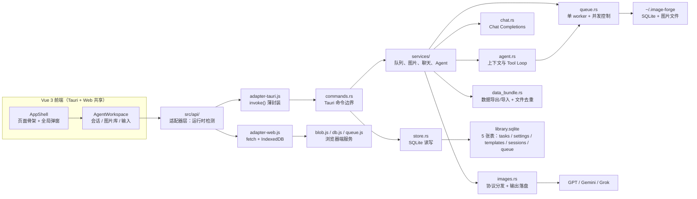
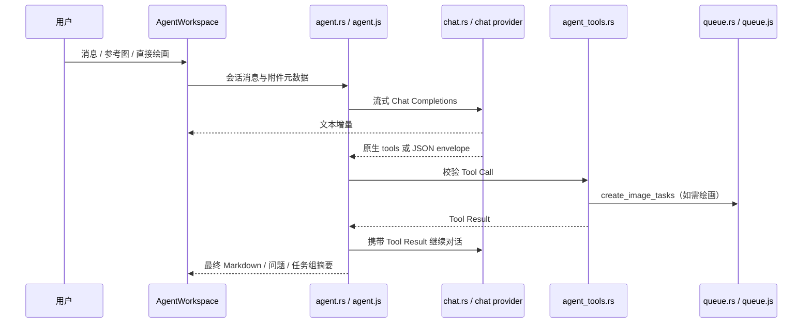
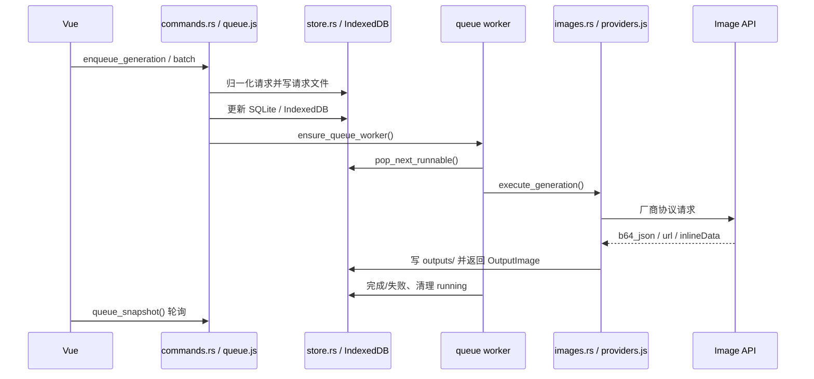

# Image Forge 技术设计

本文档描述当前实现，而不是未来路线图。Image Forge 支持两种运行模式：Tauri 2 桌面应用（Vue 3 + Rust）和纯 Web 应用（Vue 3 + IndexedDB），通过 `src/api/` 适配器层共享同一套前端代码。

## 设计目标与边界

### 目标

1. 让一次绘图从提示词、参考图、模型参数到结果文件都可追踪。
2. 让 Agent 能够理解任务并规划绘图，但不能绕过本地校验直接执行危险动作。
3. 用统一队列承接绘画模式和 Agent 模式，避免两套生成状态互相漂移。
4. 桌面版将所有配置数据存入 SQLite，`~/.image-forge/` 目录下只保留图片文件。
5. Web 版使用 IndexedDB + localStorage 存储数据，Vercel Blob 存储图片，部署时通过密码门控保护。
6. 同一套 Vue 前端代码通过适配器层，自动切换 Tauri 或 Web 运行时。

### 非目标

- 不提供终端、脚本、任意文件系统、浏览器、数据库或插件执行能力。
- 不把每个模型厂商的细节泄漏到 Vue 组件中。
- Web 版不要求服务端数据库，全部数据在浏览器端存储。

## 系统总览


```mermaid
flowchart LR
  subgraph Frontend["Vue 3 前端（Tauri + Web 共享）"]
    Shell["AppShell\n页面骨架 + 全局弹窗"] --> AgentUI["AgentWorkspace\n会话 / 图片库 / 输入"]
  end
  AgentUI --> API["src/api/\n适配器层：运行时检测"]
  API --> TauriAdapter["adapter-tauri.js\ninvoke() 薄封装"]
  API --> WebAdapter["adapter-web.js\nfetch + IndexedDB"]
  TauriAdapter --> Commands["commands.rs\nTauri 命令边界"]
  WebAdapter --> WebServices["blob.js / db.js / queue.js\n浏览器端服务"]
  Commands --> Store["store.rs\nSQLite 读写"]
  Commands --> Services["services/\n队列、图片、聊天、Agent"]
  Services --> Queue["queue.rs\n单 worker + 并发控制"]
  Services --> Images["images.rs\n协议分发 + 输出落盘"]
  Services --> Chat["chat.rs\nChat Completions"]
  Services --> Agent["agent.rs\n上下文与 Tool Loop"]
  Services --> DataBundle["data_bundle.rs\n数据导出/导入 + 文件去重"]
  Images --> Providers["GPT / Gemini / Grok"]
  Store --> SQLite["library.sqlite\n5 张表：tasks / settings / templates / sessions / queue"]
  Queue --> Data["~/.image-forge\nSQLite + 图片文件"]
  Agent --> Queue
```

应用只有一个业务状态源：`src/App.vue` 持有设置、任务历史、队列、模板、参考图和 Agent 会话状态；子组件通过 props 接收状态，通过事件把动作交回 `App.vue`。左侧功能栏可在「对话」与「图片库」两个面板间切换，不销毁另一面板的临时状态。

## 双平台适配器架构

`src/api/` 目录实现运行时环境检测，自动切换 Tauri 或 Web 适配器。

```text
src/api/
  index.js           # 环境检测：window.__TAURI_INTERNALS__
  adapter-tauri.js   # 31 个 invoke() 薄封装
  adapter-web.js     # 31 个 Web 版函数实现
  db.js              # Dexie.js IndexedDB 数据库
  blob.js            # Vercel Blob 图片存储
  providers.js       # OpenAI/Gemini/Grok 生图 API（fetch）
  queue.js           # 单 worker 队列调度
  agent.js           # Agent 对话引擎 + 工具循环
```

适配器切换机制：

```js
// src/api/index.js
const isTauri = Boolean(window.__TAURI_INTERNALS__);
const adapter = isTauri
  ? await import("./adapter-tauri.js")
  : await import("./adapter-web.js");
```

- **Tauri 模式**：`adapter-tauri.js` 通过 `invoke()` 调用 31 个 Rust Tauri 命令，零逻辑，纯转发。
- **Web 模式**：`adapter-web.js` 用 `fetch()` 直调 API、IndexedDB 存数据、Web Crypto 做哈希去重，完整复刻 Rust 端行为。
- App.vue 和所有组件通过 `import * as api from "./api/index.js"` 调用，不感知底层运行时。

## 前端架构

### 页面与工作区

| 模块 | 当前职责 |
| --- | --- |
| `src/App.vue` | 启动加载、面板切换、轮询、API 调用、Agent 会话动作、直接绘画和全局弹窗。Web 版入口密码门控。 |
| `src/components/AppShell.vue` | 页面骨架和全局插槽（工作区、底部状态栏、对话框）。 |
| `src/components/AgentWorkspace.vue` | 功能栏（新对话/图片库/设置）、会话列表、消息列表、输入区和内嵌图片库。 |
| `src/components/AgentLibraryPanel.vue` | 按月份浏览的内嵌图片库。hover 显示半透明 footer，含图片尺寸、5 个操作按钮（复制提示词、引用、添加模板、下载、定位）。图片固定 300×300。 |
| `src/components/AgentMessageList.vue` | Markdown 回复、Tool Call 状态、交互问题和任务组卡片。卡片不显示提示词，显示服务器反应状态 + 计时器 + 取消/重试按钮，完成后显示缩略图。 |
| `src/components/AgentComposer.vue` | Agent 输入、参考图（粘贴/拖放添加）、比例/分辨率下拉选择、直接绘画开关、发送和停止。 |
| `src/components/AppFooterBar.vue` | 底部状态栏、生图/对话模型选择和队列计数。 |
| `src/components/ClipboardImageMenu.vue` | 参考图右键粘贴剪贴板图片菜单。 |

### 对话框组件

| 模块 | 职责 |
| --- | --- |
| `src/components/dialogs/DesignDialog.vue` | 设计面板：API 配置、模板库、备份/恢复、关于。 |
| `src/components/dialogs/ApiSourcePanel.vue` | API 源编辑、模型列表拉取。 |
| `src/components/dialogs/TemplateEditorDialog.vue` | 模板编辑：提示词、参考图、效果图。 |
| `src/components/dialogs/DataTransferDialog.vue` | 数据导出/导入：分类多选（API 配置/模板/对话/图片库），生成 ZIP 或导入合并。 |
| `src/components/dialogs/BackupPanel.vue` | 备份/恢复入口：导出数据、导入数据按钮。 |
| `src/components/dialogs/EffectImageViewer.vue` | 效果图查看器，支持 1:1 原图显示。 |

### Agent 交互约束

- Agent 没有会话时，应用自动创建一个新会话。
- 左侧会话历史按时间稳定排列，不因选择而重新排序。
- 用户和 Agent 消息使用独立图标，双方名称和时间在消息角色区域展示。
- Agent 回复通过 `markdown-it` 渲染 Markdown；工具成功结果不把原始 JSON 直接塞进对话，只有错误以可换行文本显示。
- 任务组卡片显示服务器反应状态 + 计时器 + 取消/重试按钮；成功后显示长边 400 保持比例的缩略图，点击以 1:1 显示原图。
- 输入框默认 Enter 发送，Command/Ctrl+Enter 也发送，Shift+Enter 保留换行，输入法组合态不会误发送。
- "直接绘画"位于发送按钮下方。勾选后提示词绕过对话模型，直接以当前生图模型和默认生图参数进入绘画队列；未勾选时走对话模型，由 LLM 通过工具调用规划绘图。
- 参考图支持文件选择、剪贴板图片、右键粘贴和拖放；剪贴板同时含图片与文本时只处理图片。
- 图片库「引用」按钮：将生图时使用的所有原始参考图重新添加到提示词框，提示词预填。
- 图片库「添加到模板」按钮：将原始参考图添加到模板，提示词填入模板内容区，模板标题留空。

### 界面与资源约束

- Tauri 窗口最小逻辑尺寸为 `1200×800`，默认尺寸为 `1360×930`。
- 窗口状态保存逻辑像素尺寸；恢复时按当前显示器缩放因子换算。
- 生图模型和对话模型独立选择，位于底部状态栏。
- 图片使用 Tauri asset protocol URL 加载（桌面版）或 `/image-forge-data/` HTTP 路径（Web 开发模式）。
- Web 版通过 Vite 插件在开发时暴露 `~/.image-forge/` 目录，桌面版和 Web 版共享同一套图片文件。

### 前端工具层

| 文件 | 职责 |
| --- | --- |
| `src/lib/models.js` | 默认设置、空模板、深拷贝、设置归一化和剪贴板 API 源解析。 |
| `src/lib/options.js` | 分辨率、比例、质量、提示词模式和像素尺寸映射。 |
| `src/lib/formatters.js` | 状态、文件名、图片 URL 和通用展示格式化。 |
| `src/lib/libraryFormat.js` | 图片库任务来源、日期/月份分组与展示格式化。 |
| `src/lib/referenceFiles.js` | 解析剪贴板、拖放和 `file://` 本地路径。 |
| `src/lib/generationTimer.js` | 运行中任务计时和超时状态。 |
| `src/lib/scrollbarVisibility.js` | 覆盖式滚动条的显隐、拖动和布局隔离。 |
| `src/lib/theme.js` | Naive UI 主题覆盖（配色、圆角、字体和滚动条）。 |
| `src/tauri.js` | Tauri invoke、文件对话框、原生拖放、窗口状态和图片资源 URL。Web 版自动降级为 `fetch` 和 `URL.createObjectURL`。 |

## Rust 架构

`src-tauri/src/lib.rs` 只负责模块、插件、运行状态和 Tauri 命令注册。命令层负责边界校验和组合服务，服务层负责外部 API 或后台流程，`store.rs` 负责 SQLite 读写。

| 模块 | 职责 |
| --- | --- |
| `commands.rs` | 前端可调用命令：设置、模板、Agent、任务、数据导出/导入和清理操作。 |
| `models.rs` | Vue 与 Rust 共享的 serde 数据结构，包括任务、输出和 Agent envelope。 |
| `state.rs` | 运行期状态：队列 worker 标记、取消/删除集合和运行日志。 |
| `store.rs` | 数据目录、SQLite 读写（通过 `history_db`）、请求文件、历史/队列/模板归一化和事务。 |
| `history_db.rs` | SQLite 数据库层：建表、迁移、CRUD。6 张表管理全部结构化数据。 |
| `services/queue.rs` | 单 worker 调度、provider 并发限制、取消、重试和异常恢复。 |
| `services/images.rs` | GPT/Gemini/Grok 请求组装、响应解析和输出落盘。 |
| `services/chat.rs` | OpenAI 兼容 Chat Completions、流式回复和模板填充。 |
| `services/agent.rs` | Agent 上下文、对话循环、Tool Call、取消和错误归一化。 |
| `services/agent_tools.rs` | 工具注册、JSON schema 校验、参数限制和工具结果。 |
| `services/agent_store.rs` | Agent 会话保存、恢复、摘要和状态迁移。 |
| `services/references.rs` | 参考图哈希去重、引用扫描和孤岛资源清理。 |
| `services/template_bundle.rs` | 模板 ZIP 导入导出、清单校验、图片哈希和兼容旧格式。 |
| `services/data_bundle.rs` | 数据导出/导入：按分类打包 ZIP、文件 SHA-256 去重、合并导入。 |
| `services/models.rs` | OpenAI 风格和 Gemini 原生模型列表读取。 |
| `services/clipboard.rs` | macOS Finder 文件 URL、系统剪贴板图片和资源写入。 |

## Agent 协议与工具循环

Agent 遵循"模型决策、Rust/JS 执行、结果回传"的闭环。模型只能提出文本回复或结构化 Tool Call，执行端通过同一套 schema 校验后才执行。


```mermaid
sequenceDiagram
  participant User as 用户
  participant UI as AgentWorkspace
  participant Agent as agent.rs / agent.js
  participant Chat as chat.rs / chat provider
  participant Tools as agent_tools.rs
  participant Queue as queue.rs / queue.js

  User->>UI: 消息 / 参考图 / 直接绘画
  UI->>Agent: 会话消息与附件元数据
  Agent->>Chat: 流式 Chat Completions
  Chat-->>UI: 文本增量
  Chat-->>Agent: 原生 tools 或 JSON envelope
  Agent->>Tools: 校验 Tool Call
  Tools->>Queue: create_image_tasks（如需绘画）
  Tools-->>Agent: Tool Result
  Agent->>Chat: 携带 Tool Result 继续对话
  Agent-->>UI: 最终 Markdown / 问题 / 任务组摘要
```

### 工具集合

| 工具 | 作用 | 约束 |
| --- | --- | --- |
| `create_image_tasks` | 创建单图或多图任务组。 | 计划、提示词、数量、模型和参考图策略由执行端校验。 |
| `get_task_status` | 查询任务或任务组状态。 | 只读。 |

Agent 不拥有终端、任意文件读写、任意网络请求、浏览器或数据库工具。

### Envelope 降级协议

优先使用 Chat Completions 原生 `tools/function calling`。对不支持原生工具调用的模型，使用受限 JSON envelope：

```json
{
  "type": "assistant | tool_call | tool_result",
  "schemaVersion": 1,
  "id": "call-id",
  "name": "create_image_tasks",
  "arguments": {}
}
```

两种协议共享工具 schema、权限和错误处理。网络错误、解析错误或工具错误都会结束为可见状态，不让界面无限等待。Web 版 Agent 循环（`agent.js`）使用 `fetch()` + `ReadableStream` 流式解析 SSE 事件，支持非流式回退和 Envelope 降级。

## 图片计划与任务组

Agent 不直接拼装内部 `GenerateRequest`，而是提交结构化图片计划：

```json
{
  "title": "阳光下的柴犬",
  "prompt": "可以直接交给生图模型的最终提示词",
  "providerId": "image-provider-id",
  "resolution": "standard",
  "ratio": "1:1",
  "quality": "high",
  "referencePolicy": "use",
  "referenceIds": ["reference-id"]
}
```

执行端检查提示词非空、模型类型正确、计划数量、参考图 ID、参考图策略和资源存在性。全部计划通过后才一次性写入任务组，避免多图任务只入队一半。任务会记录 `origin=agent`、`agentSessionId`、`taskGroupId` 和模型。

## 绘图队列与原子性


```mermaid
sequenceDiagram
  participant UI as Vue
  participant Cmd as commands.rs / queue.js
  participant Store as store.rs / IndexedDB
  participant Worker as queue worker
  participant Images as images.rs / providers.js
  participant API as Image API

  UI->>Cmd: enqueue_generation / batch
  Cmd->>Store: 归一化请求并写请求文件
  Cmd->>Store: 更新 SQLite / IndexedDB
  Cmd->>Worker: ensure_queue_worker()
  Worker->>Store: pop_next_runnable()
  Worker->>Images: execute_generation()
  Images->>API: 厂商协议请求
  API-->>Images: b64_json / url / inlineData
  Images->>Store: 写 outputs/ 并返回 OutputImage
  Worker->>Store: 完成/失败、清理 running
  UI->>Cmd: queue_snapshot() 轮询
```

- `RuntimeState.worker_active` 保证同一进程（或浏览器 tab）只有一个调度循环。
- `queue.waiting` 保持任务顺序，`images_concurrency` 控制每个生图 provider 的并发。
- 任务失败可按设置自动重试一次；用户也可以手动刷新或重试。
- 应用重启时，遗留的 `running` 任务恢复到可继续处理的状态。
- Agent 多图任务使用 staged transaction：请求文件、历史记录和队列状态全部准备成功后再提交；提交失败会回滚。

## 生图协议适配

`services/images.rs`（桌面版）和 `adapters/providers.js`（Web 版）按 `modelType` 选择请求协议，不把厂商差异交给前端。仅支持三家 API：

| 类型 | 生成 | 编辑 / 参考图 | 鉴权 |
| --- | --- | --- | --- |
| `image-gpt` | `/images/generations` JSON | `/images/edits` multipart | Bearer |
| `image-gemini` | `models/{model}:generateContent` | 同端点，`inlineData` parts | `x-goog-api-key` |
| `image-grok` | `/images/generations` JSON | `/images/edits` JSON data URL | Bearer |

共同规则：Base URL 归一化，代理支持 HTTP/SOCKS（桌面版），模型列表有超时，响应支持 `b64_json`、URL 或 Gemini `inlineData`，文件头决定最终 `png/jpeg/webp` 格式。比例会写入提示词，分辨率和比例共同计算像素 `size`。

## 本地数据与资源生命周期

### 桌面版

```text
~/.image-forge/
  library.sqlite              # 全部结构化数据（6 张表）
  requests/<task-id>.json     # 队列请求文件
  outputs/YYYY/MM/<timestamp>-<task-id>-01.png
  references/<sha256>.<ext>
  export-<date>.zip           # 数据导出包
  .staging/                   # 事务暂存区
```

### SQLite 数据库结构

| 表 | 用途 | 替代的旧 JSON 文件 |
| --- | --- | --- |
| `tasks` | 任务历史记录（含完整 JSON 冗余） | `library.sqlite`（原有） |
| `task_outputs` | 任务输出图片路径 | `library.sqlite`（原有） |
| `metadata` | 迁移标记等杂项 | `library.sqlite`（原有） |
| `app_settings` | API 源配置 | `settings.json` |
| `app_templates` | 提示词模板 | `prompt-templates.json` |
| `agent_sessions` | Agent 对话会话 | `agent/sessions/*.json` |
| `app_queue` | 任务队列状态 | `queue.json` |

首次启动时自动从旧 JSON 文件迁移到 SQLite（`PRAGMA user_version = 2`），旧 JSON 文件保留原位不删除。迁移后 `~/.image-forge/` 目录下只保留 `library.sqlite` 和图片文件。

### Web 版

```text
浏览器存储：
  localStorage:
    if_settings       # API 源配置
    if_templates      # 提示词模板
    if_agent_sessions # Agent 会话
  IndexedDB (ImageForge):
    tasks             # 图片库任务历史
  Vercel Blob（生产环境）:
    图片文件           # 生图输出和参考图
```

Web 版开发时通过 Vite 插件共享 `~/.image-forge/` 下的图片文件。生产部署到 Vercel 后，图片通过 Vercel Blob 存储。

### 双向同步

`pnpm sync:web:serve` 启动本地 HTTP 服务，合并 SQLite 和浏览器 IndexedDB/localStorage 数据。以 `updated_at` 较新的记录为准，合并后写回两端。Web 开发时桌面版和浏览器共享同一套图片文件。

### 资源生命周期

参考图按内容 SHA-256 去重。任务、模板和 Agent 附件只保存路径或引用 ID；删除对象时扫描历史、模板、请求和会话引用，无人引用的资源才进入系统回收站（桌面版）或直接删除（Web 版）。

## 数据导出/导入

`services/data_bundle.rs` 实现按分类打包 ZIP，支持文件去重。

### 导出

```text
ImageForge-data-<date>.zip
  manifest.json        # 格式标识、版本、导出时间、包含的数据
  files/<sha256>.ext   # 去重后的图片文件
```

导出流程：
1. 按用户选择的分类（API 配置 / 模板 / 对话 / 图片库）读取对应数据
2. 扫描所有引用文件路径（模板参考图、会话附件、任务输出图）
3. 按 SHA-256 哈希去重，相同文件只存一份
4. 打包为 ZIP，保存到 `~/.image-forge/export-<date>.zip`

### 导入

导入流程：
1. 校验 ZIP 格式、manifest 版本、条目数量和大小限制
2. 解析 manifest，读取各分类数据
3. 合并到现有数据（不覆盖已有记录，按 ID 去重）
4. 写入 SQLite

### 前端入口

设计面板 → 备份/恢复 → 「导出数据」/「导入数据」，打开 `DataTransferDialog`。导出时勾选分类 → 生成 ZIP；导入时拖入/选择 ZIP 文件 → 自动合并。

## 模板包

```text
ImageForge-templates.zip
  manifest.json
  ImageForge-templates.md
  images/<sha256>.<ext>
```

导出始终包含全部模板；导入校验 manifest、路径和图片 SHA-256，重复模板跳过并重新分配本地 ID。没有新 manifest 时，会尽力兼容旧版 Markdown ZIP。导入限制压缩包、条目、解压后总大小和单图大小，避免把归档导入变成资源耗尽入口。

## 模型与设置

`settings.providers` 是统一配置列表，关键字段包括：

- `id`：内部稳定 ID，不展示给用户。
- `modelType`：`image-gpt`、`image-gemini`、`image-grok` 或 `chat`。
- `baseUrl`、`apiKey`、`proxyUrl`、`imageModel`：协议连接参数。
- `imagesConcurrency`：队列并发上限兼容字段。
- `activeImageProviderId`、`activeChatProviderId`：两个工作区的默认模型。

旧版本的 `modelType=image` 或未知类型会按模型名和 Base URL 推断协议，并在读取设置时归一化。导出 API 源时不导出内部 ID；导入会生成新 ID，并对重复配置去重。API Key 会以明文存在导出文件中，导出文件必须保存在可信位置。

## 窗口、资源协议与恢复

Tauri 窗口最小逻辑尺寸为 `1200×800`，默认尺寸为 `1360×930`。`src/tauri.js` 保存逻辑像素宽高，旧版物理像素状态会根据 `scaleFactor` 迁移；恢复时把窗口限制在当前显示器工作区内。

图片 `` 不直接使用本地文件路径。桌面版通过 `convertFileSrc()` 生成 asset URL；Web 版开发时通过 Vite 插件将 `~/.image-forge/` 下文件映射为 `/image-forge-data/` HTTP 路径。Tauri 的 asset protocol 开启并限制在用户 Home 目录范围内，隐藏的 `.image-forge` 数据目录额外显式授权。

## Web 版密码门控

Web 版在 `App.vue` 入口处有密码锁屏。密码通过 `VITE_ACCESS_PASSWORD` 环境变量配置；验证通过后 `localStorage` 记录认证状态，下次自动跳过。密码以明文存在于 JS bundle 中，仅适合个人使用或小团队内部工具。

## 开发与发布

### 安装与开发

```bash
pnpm install

# 桌面版开发
pnpm tauri dev

# Web 版开发（浏览器打开 http://localhost:1421）
pnpm dev
```

### 数据同步

```bash
# 桌面版 → Web 版双向合并同步（本地开发用）
pnpm sync:web:serve

# 桌面版 → 浏览器控制台导入
pnpm sync:web

# Web 版 → 桌面版反向同步
pnpm sync:desktop <导出文件路径>
```

### 前端检查与构建

```bash
pnpm test
pnpm build
```

### Rust 检查

```bash
cargo fmt --manifest-path src-tauri/Cargo.toml --check
cargo check --manifest-path src-tauri/Cargo.toml
cargo test --manifest-path src-tauri/Cargo.toml
```

### 版本升级与预发布

```bash
pnpm run patch -- <next-version>
pnpm run prerelease
```

`prerelease` 会构建、签名并在 `release/` 生成当前版本 `.app`，日常开发不生成 `.dmg`。`release/` 和构建缓存不提交 Git；临时目录清理优先使用系统回收站，回收站不可用时保留并提示，不做永久删除。

### Web 版部署到 Vercel

```bash
# 1. 配置环境变量
cp .env.example .env
# 编辑 .env：VITE_ACCESS_PASSWORD、VITE_BLOB_READ_WRITE_TOKEN

# 2. 部署
vercel --prod
```

## 扩展约定

- 新的 Tauri 命令进入 `commands.rs`，不要把业务逻辑塞入 `lib.rs`。
- 桌面版 SQLite 读写进入 `history_db.rs`；Web 版 IndexedDB 读写进入 `db.js`。
- 新增 API 适配器函数：在 `adapter-tauri.js`（invoke 封装）和 `adapter-web.js`（JS 实现）同时添加，`index.js` 导出列表同步更新。
- 外部 API、队列和协议进入 `services/`（Rust）或 `src/api/`（Web）。
- 新增持久化数据必须同步更新 SQLite 表结构（`history_db.rs`）和 IndexedDB 表结构（`db.js`）。
- 新增模型协议必须同时更新 provider 归一化、模型列表、请求组装、响应解析和测试。
- 新增 Agent 工具必须同时更新 schema、权限边界、降级 envelope 和集成测试。
- UI 组件通过 props/events 与 `App.vue` 协作，避免在展示组件中直接写业务状态。
- 前端组件同时兼容 Tauri 和 Web 运行时，不直接调用 `invoke()`，统一通过 `api.*` 调用。